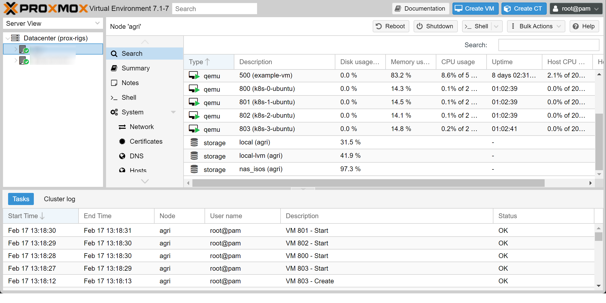
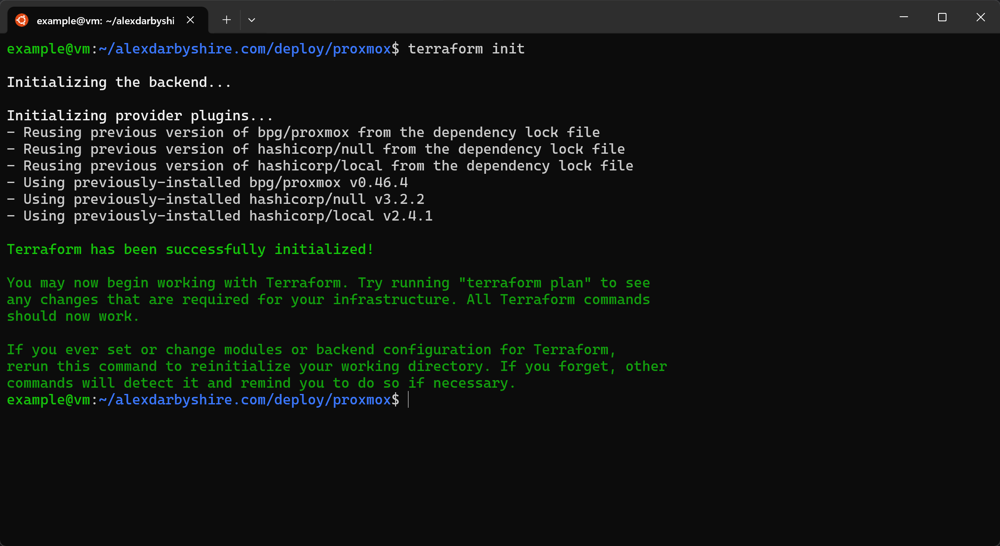
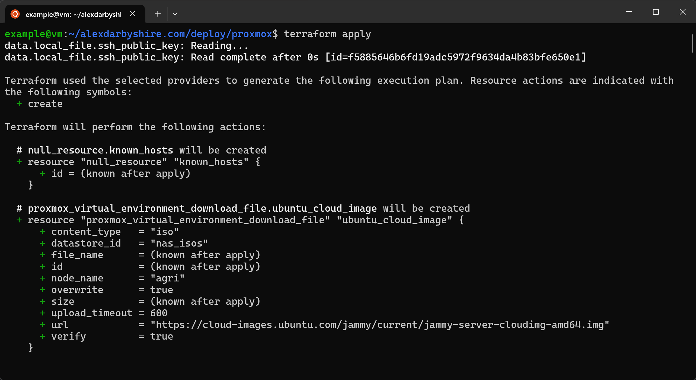
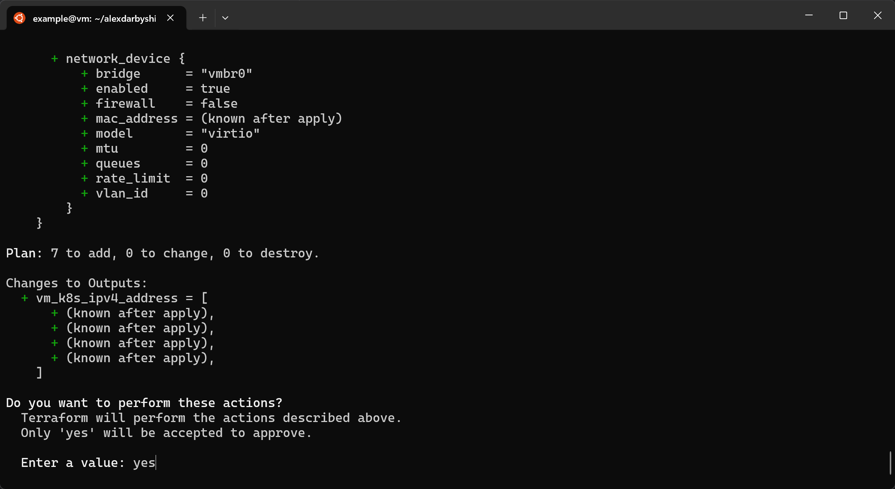
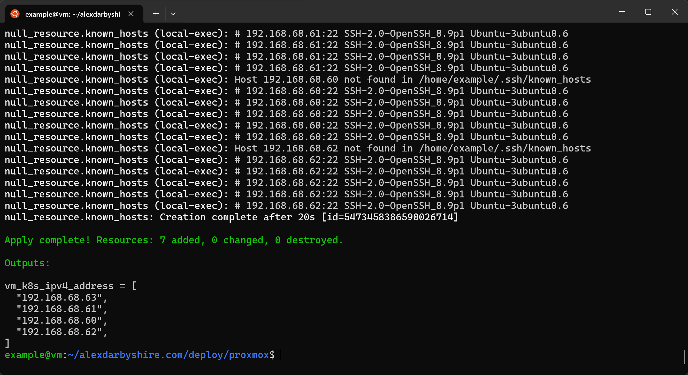
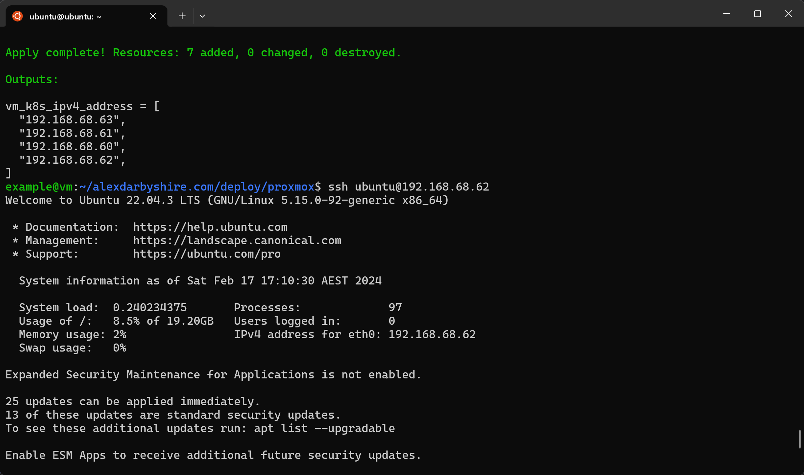

A guide to using the Terraform bpg provider to create virtual machines on a Proxmox instance.

The bpg provider is a wrapper for the Proxmox API. It enables the provisioning of infrastructure on Proxmox using Terraform.

bpg is one of two terraform providers available for Proxmox at time of writing, the other option being telmate. Both are active based on their GitHub repos, at a quick glance bpg was a bit more active, and a few positive posts about bpg swayed the decision towards it.

The intended future use case of the VMs is a Kubernetes cluster. We will take an iterative approach to creating the VMs. The number of VMs to create will be configured as a variable, allowing us to set the quantity required at runtime (of `terraform apply`). 

## Example
[Checkout the end result in GitHub](https://github.com/alexdarbyshire/alexdarbyshire.com/tree/704f2dbba3b9bf8d16ab8d449b3633a506b5883e/deploy/proxmox) 



## Tech Stack
* **Proxmox VE** 7.1-7
* **Terraform** 1.7.1
* **bpg/proxmox** 0.46.4
* **Ubuntu** Jammy current cloud image

## Bring Your Own
* **Proxmox**
* **Terraform**
    * [An earlier post on Vault covers how to install Terraform]()
* **Terminal to run Terraform**
## Steps

### Define Terraform Resources
#### Add the bpg Provider
Create a file `main.tf` with contents:
```terraform
terraform {
  required_providers {
    proxmox = {
      source = "bpg/proxmox"
      version = "0.46.4"
    }
  }
}

provider "proxmox" {
  endpoint = var.virtual_environment.endpoint
  insecure = true                               # Using self-signed TLS certificate currently
  username = var.virtual_environment.username
  password = var.virtual_environment.password

  ssh {
    agent = true
    }

}
```
Within the provider we set several configuration arguments to variables.

Initially tried using a Proxmox API token, there is a bit less friction using username and password. The tokens require more setup in terms of permissions. Also, the bpg documentation mentioned there were a few Proxmox API features are not usable with a token.
#### Add the Virtual Machine Resources
Create file `vms.tf` with contents:
```terraform
resource "proxmox_virtual_environment_vm" "ubuntu_vm" {
  count = var.virtual_environment.vm_count

  name      = "k8s-${count.index}-ubuntu"
  node_name = var.virtual_environment.node_name

  vm_id = "${format("8%02s", count.index)}" #This formats the vm_id in Proxmox to 800, 801, 802, etc

  agent {
    enabled = true
  }

  cpu {
    cores = 2
  }

  memory {
    dedicated = 8192
  }

  disk {
    datastore_id = var.virtual_environment.storage_ssd
    file_id      = proxmox_virtual_environment_download_file.ubuntu_cloud_image.id
    interface    = "virtio0"
    iothread     = true
    discard      = "on"
    size         = 20
  }

  initialization {
    ip_config {
      ipv4 {
        address = "dhcp"
      }
    }

    user_data_file_id = proxmox_virtual_environment_file.cloud_config.id
  }

  network_device {
    bridge = "vmbr0"
  }

}


#Specify the image to use
resource "proxmox_virtual_environment_download_file" "ubuntu_cloud_image" {
  content_type = "iso"
  datastore_id = var.virtual_environment.storage_nas
  node_name    = var.virtual_environment.node_name

  url = "https://cloud-images.ubuntu.com/jammy/current/jammy-server-cloudimg-amd64.img"
}
```
Notably we use `count` argument in the above which tells Terraform we want to iterate creation of the resource. The number to create is specified as a variable which we get to in a minute.

The `user_data_file_id` argument refers to a Proxmox snippet allowing a custom `cloud-init`.


#### Add Custom `cloud-init`

The cloud Ubuntu images do not come stock with `qemu-guest-agent` which Proxmox uses to monitor its guests (VMs). It is useful for several reasons, key is communicating the DHCP dynamically assigned IP address the guest receives back to host and then back Terraform.

The following sets us up to install `qemu-guest-agent` and to add an SSH key to allow future SSH access.

Create file `vm-cloud-int.tf` with the following contents:
```terraform
#Custom cloud-init to add qemu-guest-agent and SSH key

resource "proxmox_virtual_environment_file" "cloud_config" {
  content_type = "snippets"
  datastore_id = var.virtual_environment.storage_nas
  node_name    = "agri"

  source_raw {
    data = <<EOF
#cloud-config
users:
  - default
  - name: ubuntu
    groups:
      - sudo
    shell: /bin/bash
    ssh_authorized_keys:
      - ${trimspace(data.local_file.ssh_public_key.content)}
    sudo: ALL=(ALL) NOPASSWD:ALL
runcmd:
    - apt update
    - apt install -y qemu-guest-agent net-tools
    - timedatectl set-timezone Australia/Brisbane
    - systemctl enable qemu-guest-agent
    - systemctl start qemu-guest-agent
    - echo "done" > /tmp/cloud-config.done
    EOF

    file_name = "cloud-config.yaml"
  }
}
```

#### Add the Data Sources
We let Terraform know which SSH key we want it to inject.

Create file `data-sources.tf` with contents:
```terraform
#Load local SSH key for injecting into VMs
data "local_file" "ssh_public_key" {
  filename = pathexpand("~/.ssh/id_ed25519.pub")
}
```
The `pathexpand` function turns the tilde `~` into the home directory of the user applying the Terraform plan.

#### Add Outputs
Let's get the IP address for use in subsequent workflows.

Create file `outputs.tf` with contents:
```terraform
#The IP addresses of the VMs
output "vm_k8s_ipv4_address" {
  value = proxmox_virtual_environment_vm.ubuntu_vm[*].ipv4_addresses[1][0]
}
```

#### Using a `local-exec` Provisioner to Add New VMs ssh-keys to `known hosts`
This prevents the need to accept the hosts manually when SSH'ing in the first time.

```terraform
locals {
  ssh_hosts = proxmox_virtual_environment_vm.ubuntu_vm[*].ipv4_addresses[1][0]
}

#Add machines to known hosts after creating
resource "null_resource" "known_hosts" {

  provisioner "local-exec" {
    command = <<EOT
    sleep 20;
    %{for host_ip in local.ssh_hosts}
        ssh-keygen -R ${host_ip}
        ssh-keyscan -H ${host_ip} >> ~/.ssh/known_hosts
    %{ endfor ~}
    EOT
       interpreter = ["/bin/bash", "-c"]
    }
}
```

This waits 20 seconds, then on the machine running Terraform it:
* removes each VM host's key if existing
* adds VM host's key

It is a little hacky, and may have security implications depending on the environment in that it could open us up to a man-in-the-middle attack. Outside a test environment we might look at a more robust solution.

### Configure Terraform Variables
#### Define the Variables
Create a file `variables.tf` with contents:
```terraform
variable virtual_environment {
  type = object({
    endpoint = string           #Proxmox hostname and port https://proxmox-instance:8006
    node_name = string          #Proxmox node to create VMs on
    storage_nas = string        #Proxmox storage ID to store cloud images on
    storage_ssd = string        #Proxmox storage ID for the LVM
    username = string           #Proxmox username e.g. root@pam
    password = string           #Proxmox password
    vm_count = number           #Number of VMs to spin up
  })
}
```

#### Assign Values to the Variables
Create file `terraform.tfvars` with content:
```
virtual_environment = {
  endpoint = "https://ip-or-hostname:8006/"
  username = "root@pam"
  password = "apasswordgoeshere"
  node_name = "proxmox-node-name-goes-here"
  storage_nas = "local"
  storage_ssd = "local-lvm"
  vm_count = 4
}
```
Update to suit the setup. The password should be the one for the Proxmox host's root user (or create a new user and password on the host and add the user to `sudoers`).


There are a couple alternative approaches.

Environment Variables could be used, Terraform will apply those that are prefixed with `TF_VAR`, e.g. `TF_VAR_virtual_environment='{endpoint="https://proxmox-instance:8006"}'`

Command line arguments to the `terraform` command can also be used to pass the values.

In this example we went with a `.tfvars` file. This has been excluded from the GitHub repo using `.gitignore`, there is an example file `terraform.tfvarsexample` in the repo.


### Apply the Terraform Plan

```bash
terraform init
terraform apply
```




Type `yes` when prompted:




#### Success
And now we `ssh` straight into one of the new VMs:


### Cleanup
#### Add a `.gitignore` file
Create a `.gitignore` file to exclude some files from the repo.
```text
*.tfvars
.terraform
.terraform.lock.hcl
terraform.tfstate*
```
Depending on use case, `terraform.state*`  and `.terraform.lock.hcl` may be omitted. That would keep the state of the terraform infrastructure in the repo, and prevent unspecified versions' providers from upgrading.

#### Commit
Check what will be added with `git status`

Then add and commit.
```
git add .
git commit -m 'Add terraform plan for deploying n VMs to Proxmox using the bpg provider'
```

## Done
In the next post, we will explore getting Kubernetes up and running on the Terraform provisioned virtual machines.
