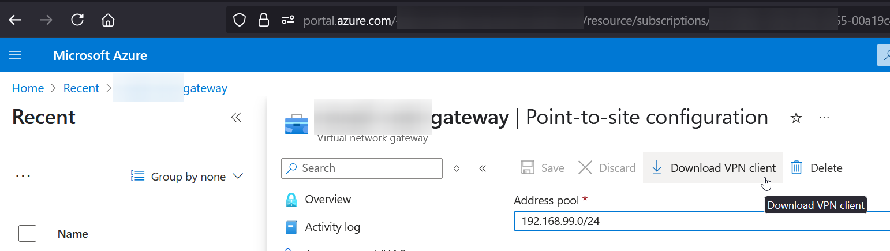

A short exploration of options for connecting to resources with private VNETs in Azure. Focused on boutique dev work. Think access to state maintaining services like SQL databases, CosmosDB, Redis etc.

Costs are indicative at time of writing. Costs vary between Azure regions. Figures are in AUD, multiply by .6 to get an approximate in USD.

I haven't considered use of Site to Site (S2S) VPNs to connect to existing Point to Site (P2S) VPNs here, if that connectivity is a requirement then these options are likely not relevant.

## Quick Comparison

| Option | Monthly Cost (AUD) | Setup Complexity | Cross-Platform | Maintenance | Best For |
|--------|-------------------|-----------------|----------------|-------------|----------|
| VM with Tailscale | $12+ | Medium | Yes | Low | Small teams on a budget with flexible tooling |
| Basic VPN Gateway | $41 | Medium | Windows-only | Medium | Windows teams with budget considerations |
| Bastion with SSH | $1-216 | Medium | Yes | Low | Occasional access needs |
| VpnGw1 Gateway | $215 | Medium | Yes | Low | Enterprise teams requiring high reliability |

## Service-Level IP Whitelisting (ick)
*Cost: AUD$0 per month*

The "it's all too hard approach". Don't use a Private VNET at all. Make any service that need access public and block all IPs by default, then whitelist specific developer IP addresses as needed. This is free but requires the most maintenance.

Limitations of this approach: dynamic IP addresses, shared connections, and the administrative overhead of constantly updating IP allowlists as developers work from different locations.

Least secure, requires most maintenance. Possibly suitable for temporal testing environments where  consequences of a breach are non-meaningful.

## The cheapest Azure VM with Tailscale
*Cost: AUD$6.14 per month + USD$6 per dev per month*

Deploy say a B1ls VM (AUD$6.14 per month) running Tailscale (USD$6 per business user per month). This creates a secure mesh network that provides access to your private VNET through the VM.

Good option, as long as getting another provider/license (Tailscale) approved isn't a hassle. Adds a little complexity.

## Point-to-Site VPN (Basic) - Azure VPN Gateway
*Cost: AUD$40.92 per month*

The Basic SKU VPN gateway supports P2S connections using the proprietary SSTP protocol (Windows only). OpenVPN is not available at this SKU. WSL can connect via the VPN connection in Windows. You can download the client configuration from Azure and run the PowerShell script without local admin rights. Pretty handy in corporate environments where you are supporting development environments without admin.

Notably, the basic level can only be created with Azure CLI. It is not available in the Azure Web Portal.

Reasonable middle ground for small teams developing in Windows that need reliable access without premium features.

[MS Azure docs for creating an Azure VPN gateway of Basic SKU](https://learn.microsoft.com/en-us/azure/vpn-gateway/create-gateway-basic-sku-powershell)

The MTU for the VPN PPP NIC is 1400, and any NICs or virtual networks using the VPN should be set at 1350 to allow overhead. This deserves a post of its own to describe the less than informative hanging SSL behaviour in WSL.

You will also have to handle hostnames/DNS within the VNET yourself, either via hosts (requires admin, or limited to WSL) or possibly [config](https://learn.microsoft.com/en-us/azure/vpn-gateway/azure-vpn-client-optional-configurations). I opted for using IPs and allowing invalid SSL for the hostname side of things.

### Creating VPN Gateway Basic Azure CLI
Presuming a VNET `my-vnet` in resource group `my-vnets-rg`

#### Create a public IP
```bash
az network public-ip create --name my-vnet-vpn-ip --resource-group my-vnets-rg --location anyazurelocation --allocation-method Dynamic --sku Basic
```

#### Create the VPN Gateway
```bash
az network vnet-gateway create --name my-vnet-gateway --resource-group my-vnets-rg --location sameazurelocation --vnet my-vnet --public-ip-address my-vnet-vpn-ip --gateway-type Vpn --vpn-type RouteBased --sku Basic 
```

### Creating certs in Linux/WSL
#### Create self-signed certs
https://learn.microsoft.com/en-us/azure/virtual-wan/point-to-site-certificates-linux-openssl

#### Generate CA key and cert
```bash
openssl genrsa -out caKey.pem 2048
openssl req -x509 -new -nodes -key caKey.pem -subj "/CN=VPN CA" -days 3650 -out caCert.pem
```

#### Export CA cert to base64 (for loading into Azure)
```bash
openssl x509 -in caCert.pem -outform der | base64 -w0 && echo
```

Add the base64 CA Cert to Azure via UI. In Azure Web UI, within the Virtual Network Gateway. Settings -> Point-to-site configuration -> Root Certificates, or CLI

#### Make a user cert
```bash
export PASSWORD="password"
export USERNAME=$(hostnamectl --static)

# Generate a private key
openssl genrsa -out "${USERNAME}Key.pem" 2048

# Generate a CSR (Certificate Signing Request)
openssl req -new -key "${USERNAME}Key.pem" -out "${USERNAME}Req.pem" -subj "/CN=${USERNAME}"

# Sign the CSR using the CA certificate and CA key
openssl x509 -req -days 365 -in "${USERNAME}Req.pem" -CA caCert.pem -CAkey caKey.pem -CAcreateserial -out "${USERNAME}Cert.pem" -extfile <(echo -e "subjectAltName=DNS:${USERNAME}\nextendedKeyUsage=clientAuth")
```

#### Export the user cert to PFX
```bash
openssl pkcs12 -export -in "${USERNAME}Cert.pem" -inkey "${USERNAME}Key.pem" -certfile caCert.pem    -out "${USERNAME}.PFX"
```

#### Install the PFX into the windows user store 
Open the PFX file in Windows


### Download client
In Azure Web UI, within the Virtual Network Gateway. Click Settings -> Point-to-site configuration -> Download VPN Client
or use `az network vnet-gateway vpn-client generate` with the appropriate params



From the generated zip file, run the \Powershell\VpnProfileSetup.ps1 script to install the VPN
```powershell
powershell -ExecutionPolicy bypass .\VpnProfileSetup.ps1
```

## Bastion Host with SSH Tunnelling
*Cost: AUD$1-216 per month during active development*

Azure Bastion - The Basic SKU is around AUD$0.30 per hour. Using a Bastion means SSH tunneling to connect to services within the VNET. Not ideal for regular use. Good for short term use or as needs usage. Cost can be equivalent to VPN Gateway if in use regularly.

## Point-to-Site VPN (VpnGw1) - Azure VPN Gateway
*Cost: AUD$215 per month*

The VpnGw1 SKU provides full OpenVPN support and better performance characteristics than the Basic gateway.

# Summary
All of these options have their place.

- Developing with minimal need to directly access state - Bastion when you need to.
- Cost not a factor - VPN Gateway above basic SKU.
- Easy to get an additional vendor approved and on a budget - VM with Tailscale
- Corporate Windows environment and on a budget - VPN Gateway Basic SKU


