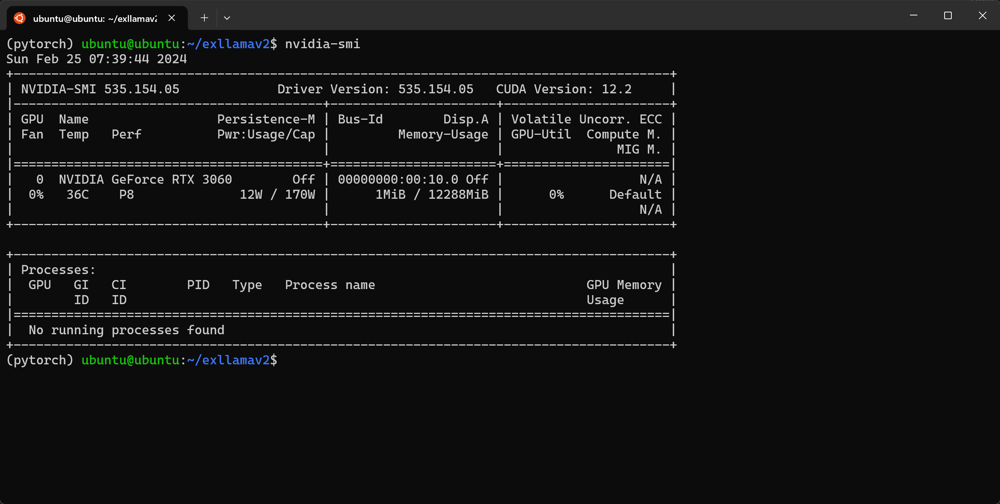
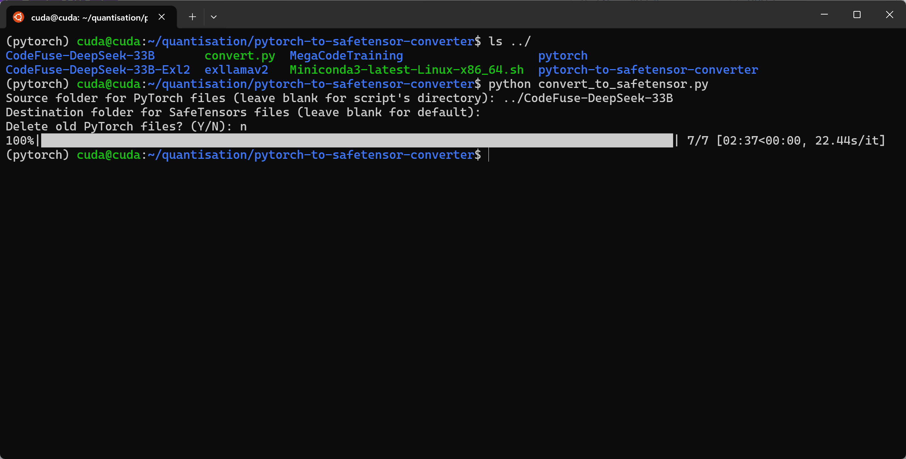
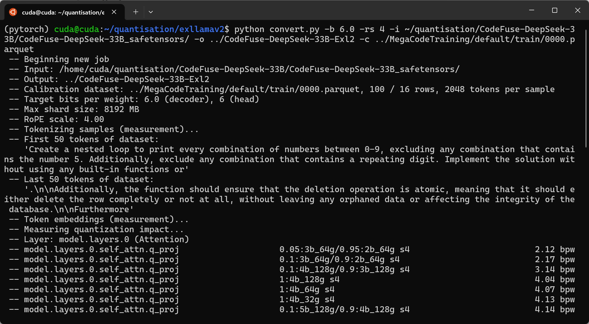
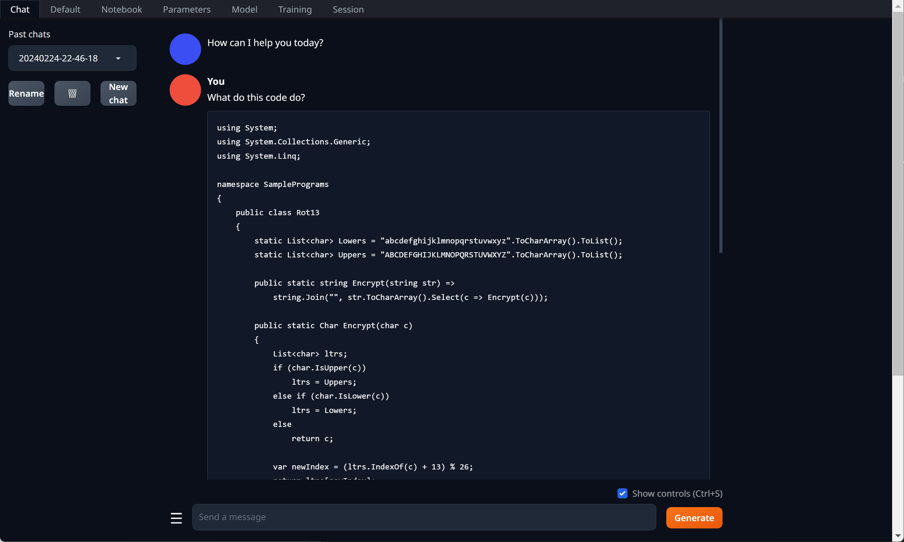
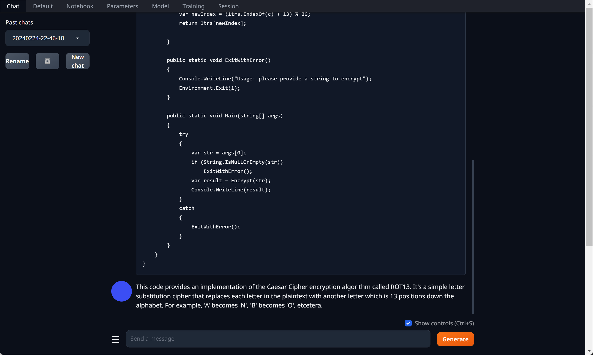

A set of notes on converting a transformers model from Pytorch format to Safetensors format and then quantising to ExLlamaV2 (Exl2) using a code based calibration dataset.

This was inspired by posts which reported coding LLMs quantised to Exl2 format using the `wikitext` default calibration dataset resulted in relatively lower quality outcomes.

[ExLlamaV2 is the excellent work of Turboderp](https://github.com/turboderp/exllamav2). It is an inference library for running LLMs on consumer GPUs. It is fast and supports multi-GPU hosts. There some trade-off between increased speed and loss of quality.

In the example we are converting [codefuse-ai/CodeFuse-DeepSeek-33B](https://huggingface.co/codefuse-ai/CodeFuse-DeepSeek-33B) to Exl2 6bpw (bits per weight).

I am yet to play with this model. It is a finetune of DeepSeek Coder 33B which a good open-source coding model with a license allowing commercial usage.

The conversion process took just under 3 hours. It was successful using a single RTX 3060 with 12GB VRAM, and approximately 64GB RAM.

## Before


## After


## Techstack
* **Ubuntu Linux** 22.04
* **Conda**
* **Pytorch**
* **Nvidia CUDA Toolkit**
* **Pytorch**
* **Tensors**
* **ExLlamaV2**

## Bring Your Own
* **Host with Ubuntu**
* **Nvidia GPU**
    * Minimum 12GB VRAM for a 33 billion parameter model
* **64GB available RAM**
* **100GB+ available disk space**
* **Software for Testing the Quantised Model** (e.g. Text generation web UI, KoboldAI-Client, etc.)

### Install Nvidia Drivers
This step is relevant to those who have an Nvidia GPU and don't have the drivers installed.
```bash
curl -fsSL https://nvidia.github.io/libnvidia-container/gpgkey | sudo gpg --dearmor -o /usr/share/keyrings/nvidia-container-toolkit-keyring.gpg   && curl -s -L https://nvidia.github.io/libnvidia-container/stable/deb/nvidia-container-toolkit.list |     sed 's#deb https://#deb [signed-by=/usr/share/keyrings/nvidia-container-toolkit-keyring.gpg] https://#g' | sudo tee /etc/apt/sources.list.d/nvidia-container-toolkit.list
sudo apt-get update
sudo apt-get install -y nvidia-container-toolkit nvidia-headless-535 nvidia-utils-535-server
sudo reboot #Reboot required for driver to load
```
`nvidia-container-toolkit` is not strictly needed for the process outlined. It is pretty handy for related workloads like running LLMs, their APIs and user interfaces in containers.

This driver setup is for hosts that won't be using X Windows or otherwise need the GPU to display to a monitor connected to the host. This is what the `headless` refers to.

We can confirm successful installation with the `nvidia-smi` command:


### Install Conda
```bash
curl https://repo.anaconda.com/miniconda/Miniconda3-latest-Linux-x86_64.sh -O
chmod +x Miniconda3-latest-Linux-x86_64.sh
./Miniconda3-latest-Linux-x86_64.sh
```
We use Conda to manage Python environments. It makes handling dependencies easier when using multiple Python projects.

### Create a Virtual Environment using Conda
```bash
conda create -n pytorch python=3.11 -y
conda activate pytorch
```


### Install Hugging Face Hub Package 
```bash
conda install huggingface_hub
```
This package includes `huggingface-cli` which allows easy access to files on Hugging Face.

### Download the Model
```
huggingface-cli download codefuse-ai/CodeFuse-DeepSeek-33B --local-dir CodeFuse-DeepSeek-33B
```

### Convert Model in Pytorch Format to Safetensors Format
```bash
clone https://github.com/Silver267/pytorch-to-safetensor-converter.git
cd pytorch-to-safetensor-converter
pip install -r requirements.txt
python convert_to_safetensor.py
```

[This repo is the work of Silver267](https://github.com/Silver267/pytorch-to-safetensor-converter) as adapted and updated from Hugging Face's convert script.

### Install Pytorch
```bash
conda install pytorch pytorch-cuda=12.1 nvidia/label/cuda-12.1.0::cuda-nvcc nvidia/label/cuda-12.1.0::cuda-toolkit -c pytorch -c nvidia
```
Pytorch is a dependency of ExLlamaV2.

### Install ExLlamaV2
```bash
git clone https://github.com/turboderp/exllamav2
cd exllamav2
pip install .
```
We install from source to prevent issues with CUDA versions not matching.


### Download Calibration Dataset
```bash
cd ..
huggingface-cli download --repo-type dataset rombodawg/MegaCodeTraining --revision refs/convert/parquet --include '*.parquet' --local-dir MegaCodeTraining
```
The dataset is used for calibration data when quantising the model from Safetensors format to ExLlamaV2. It is in the `parquet` format as required by ExLlamaV2.  

This followed the example set by [epicfilemcnulty in this post.](https://www.reddit.com/r/LocalLLaMA/comments/17bv136/new_and_better_especially_smaller_ones_exl2/)


### Quantise the Safetensors Model to ExLlamaV2
```bash
cd exllamav2
python convert.py -b 6.0 -rs 4 -i ../CodeFuse-DeepSeek-33B/CodeFuse-DeepSeek-33B_safetensors/ -o ../CodeFuse-DeepSeek-33B-Exl2 -c ../MegaCodeTraining/default/train/0000.parquet
```
We set the desired average bits per weight to 6.0. This a relatively high bpw, the intended system has 48GB available VRAM. Note `rope-scaling` does not read automatically from the model's `config.json`, DeepSeek Coder's is 4. For many other models I have seen the value is 1. 



### Put it Together for the Fully Compiled Model

```bash
cd ..
mkdir CodeFuse-DeepSeek-33B-Exl2-6.0bpw
mv CodeFuse-DeepSeek-33B-Exl2/output*.safetensors CodeFuse-DeepSeek-33B-Exl2-6.0bpw 
for file in CodeFuse-DeepSeek-33B-Exl2-6.0bpw/output-*.safetensors; do mv "$file" "${file/output/model}"; done
find CodeFuse-DeepSeek-33B -maxdepth 1 -mindepth 1 -type f ! -name "*.bin"  -exec cp {} CodeFuse-DeepSeek-33B-Exl2-6.0bpw \;
cd CodeFuse-DeepSeek-33B-Exl2-6.0bpw 
```
This creates a directory with all the files required to run the quanitised model using any software which runs Exl2 models (e.g. ExLlamaV2, TabbyAPI, Text generation web UI, KoboldAI-Client, LocalAI).

It may also be pushed to a Hugging Face repo to give back and share the work. We would update the README.md to reflect the changes to the model.

Subsequent quants of the same model can be done quicker by leveraging the calculations done on the first by passing in the the `measurement.json` file, e.g. `-m CodeFuse-DeepSeek-33B-Exl2/measurement.json`. Refer to the [ExLlamaV2 documentation](https://github.com/turboderp/exllamav2/blob/master/doc/convert.md) for additional details.

Note, there is a command line arg for the ExLlamaV2 `convert.py` which will create a fully compiled directory as part of its output, it is `-cf` followed by the path. This would be cleaner than the `find` and `for` loop employed in the above code block. 

```bash
ls -lah
```


### Test the Quantised Model Answers a Question
These screenshots are of loading and testing the model in Text Generation Web UI. How to set this up is not part of today's notes. The inclusion is to demonstrate that the resulting model passes the smoke test.






Initial tests using the `Suggest one improvement to this code` prompt are yielding better output than the Exl2 quantisied model which I have been using of late [(LoneStriker/deepseek-coder-33b-instruct-5.0bpw-h6-exl2)](https://huggingface.co/LoneStriker/deepseek-coder-33b-instruct-5.0bpw-h6-exl2).

## Success
Time for further testing of the quantised model with development tasks. 


