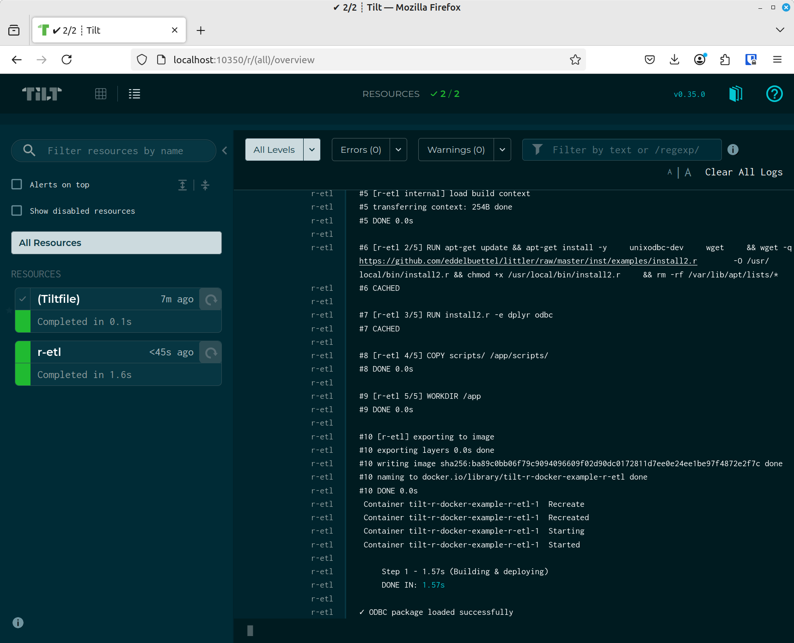
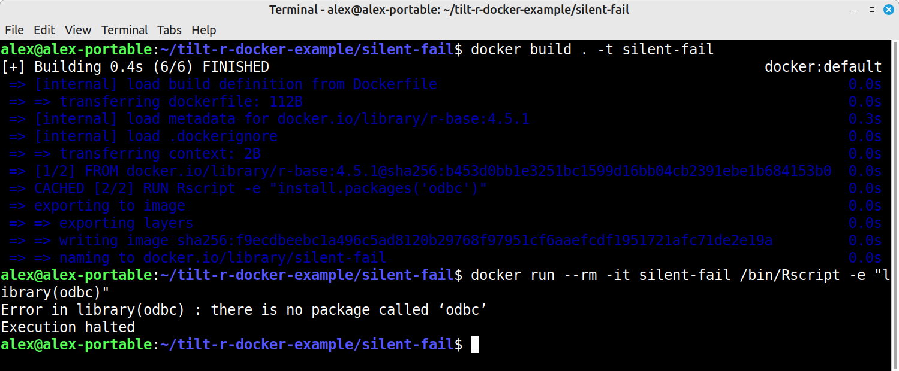
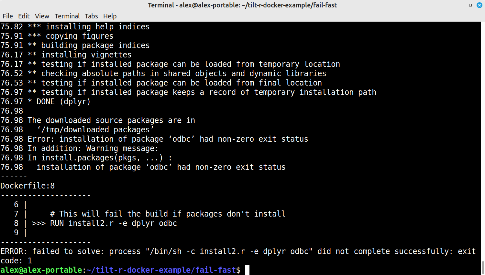
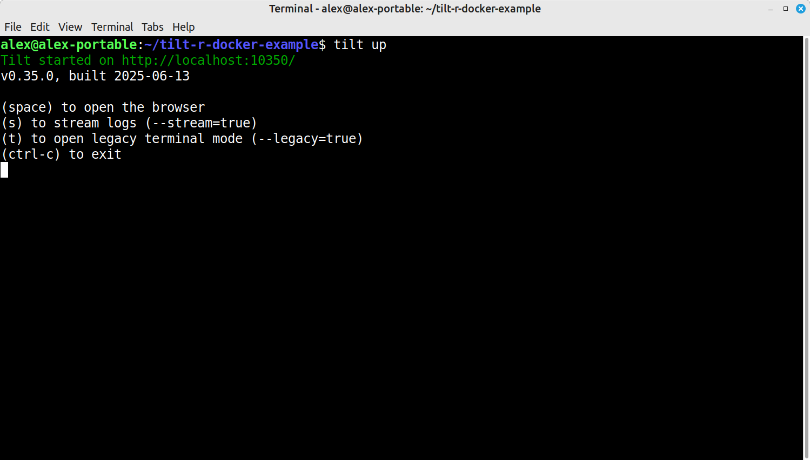

Crafting and optimising Dockerfiles can be a bit tedious with the edit-build-test cycle, especially when optimising layer caching and working with multi-stage builds. Running commands or clicking buttons on every change—where is our hot reloading?

An answer - [`Tilt`](https://tilt.dev/). Tilt's primary purpose is providing local dev environments for microservice development, like a whole Kubernetes stack or Docker Compose stack. 

Tilt is an awesome, rewarding tool which I use regularly. Part of its offering is monitoring Dockerfiles for changes with automatic rebuilds and displaying this in a web UI. Hot reloading for the Dockerfile creator.



Introducing a language-specific quirk with a much more niche audience—R Docker images in particular bring another complication. R's standard [`install.packages()`](https://stat.ethz.ch/R-manual/R-devel/library/utils/html/install.packages.html) function does not return an error exit code on package installation failure. It warns instead. The [`install2.r`](https://github.com/eddelbuettel/littler/blob/master/inst/examples/install2.r) script provides proper build failures.

## Tech Stack
- Ubuntu Linux
- Tilt
- Docker Engine (with Compose)

## The Silent Failure Problem in R Builds

R package installations can fail without failing the Docker build. 

Usually this is a forgotten system package, e.g., `RUN apt update && apt install -y unixodbc-dev`

In these instances, [`install.packages()`](https://stat.ethz.ch/R-manual/R-devel/library/utils/html/install.packages.html) returns successfully with some warning messages somewhere up in the build log, leaving you with a broken image that only fails at runtime. 

```dockerfile
# This can silently fail
FROM r-base:4.5.1
RUN Rscript -e "install.packages('odbc')"
```




The [`install2.r`](https://github.com/eddelbuettel/littler/blob/master/inst/examples/install2.r) script from the littler package properly propagates R errors as exit codes when used with the `-e` parameter:

```dockerfile
FROM r-base:4.5.1

# Download install2.r script
RUN wget -q https://github.com/eddelbuettel/littler/raw/master/inst/examples/install2.r \
    -O /usr/local/bin/install2.r && chmod +x /usr/local/bin/install2.r

# This will fail the build if packages don't install
RUN install2.r -e dplyr odbc
```



Now missing dependencies cause immediate build failures rather than runtime surprises.

## Faster Dockerfile Development with Tilt

The traditional Docker workflow—edit, build, test, repeat—becomes painful with R's longer package installation times. [`Tilt`](https://tilt.dev/) provides hot reloading for Docker builds (and a whole lot more).

This example is R-specific, but the concept is of course applicable when developing any Dockerfile.

First, create a [`docker-compose.yml`](https://docs.docker.com/compose/) file:

```yaml
# docker-compose.yml
services:
  r-etl:
    build: .
    volumes:
      - ./scripts:/app/scripts
```

This is essentially boilerplate to get Tilt to provide the functionality we want. If we don't have Docker Compose, it will ignore the image build, thinking it's not part of our dev stack.

Then create a [`Tiltfile`](https://docs.tilt.dev/index.html):

```python
# Tiltfile
docker_compose('./docker-compose.yml')
```

Start with [`tilt up`](https://docs.tilt.dev/cli/tilt_up.html). When you save changes to your Dockerfile, Tilt automatically rebuilds and shows progress in its web UI. The feedback loop is markedly improved.



For R script changes without full rebuilds, use [`live_update`](https://docs.tilt.dev/live_update_tutorial.html):

```python
# Existing Tiltfile
docker_build('r-etl', '.', 
    live_update=[
        sync('./scripts', '/app/scripts'),
    ])
```

## Complete Example

```dockerfile
FROM r-base:4.5.1 as r-etl

# Install system dependencies and download install2.r
RUN apt-get update && apt-get install -y \
    unixodbc-dev \
    wget \
    && wget -q https://github.com/eddelbuettel/littler/raw/master/inst/examples/install2.r \
       -O /usr/local/bin/install2.r && chmod +x /usr/local/bin/install2.r \
    && rm -rf /var/lib/apt/lists/*

# Build fails if packages don't install
RUN install2.r -e dplyr odbc

COPY scripts/ /app/scripts/
WORKDIR /app

CMD ["Rscript", "scripts/etl.R"]
```

```yaml
# docker-compose.yml
services:
  r-etl:
    build: .
    volumes:
      - ./scripts:/app/scripts
```

```python
# Tiltfile
docker_compose('./docker-compose.yml')
docker_build('r-etl', '.',
    live_update=[
        sync('./scripts', '/app/scripts'),
    ])
```

Here's a simple ETL script that demonstrates the ODBC dependency:

```r
# scripts/etl.R
tryCatch({
  library(odbc)
  cat("✓ ODBC package loaded successfully\n")
}, error = function(e) {
  cat("✗ Failed to load ODBC package:", e$message, "\n")
  quit(status = 1)
})
```

## Conclusion
Tilt is handy for anyone crafting Dockerfiles regularly, and [`install2.r`](https://github.com/eddelbuettel/littler/blob/master/inst/examples/install2.r) reduces friction in the life of an R Dockerfile creator.