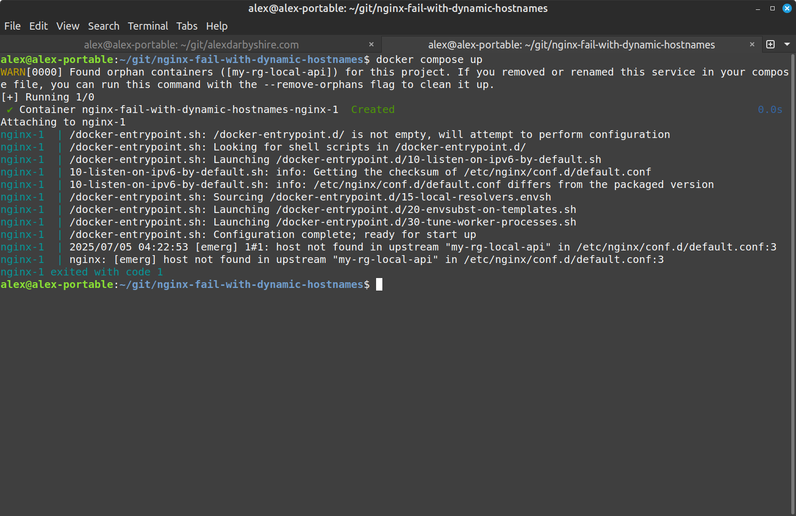

Nginx fails to start when upstream services aren't available at startup time, showing `host not found in upstream`. This post focuses on fixing this issue in Docker first, then extends the solution to Kubernetes and Azure Container Apps.

The error occurs because Nginx resolves all hostnames at startup, not request time. This fail-fast behaviour is reasonable in many environments, but problematic in container orchestration where services start in unpredictable order or may not always be available by design.

Usually I would use Kubernetes ingress annotations, Kustomize, Helm and/or Namespaces to handle this - Azure Container Apps requires a different approach. I came across this when implementing separate environments for development, staging and production, and wanting to name the containers in a way that was descriptive within the Azure Sub.

**Complete working example**: [nginx-docker-k8s-aca-example](https://github.com/alexdarbyshire/nginx-docker-k8s-aca-example) repository demonstrates this solution across all three platforms.

## Why This Matters

Nginx is designed to fail fast if upstream hosts aren't available at startup. This behavior creates problems in some container environments.

As [Sandro Keil explains](https://sandro-keil.de/blog/let-nginx-start-if-upstream-host-is-unavailable-or-down/), Nginx's default behavior prevents containers from starting when upstream services aren't yet available.

## Docker Upstream Availability Problem

When you see this error in Docker:
```
nginx: [emerg] host not found in upstream
```



The problem happens when nginx tries to resolve upstream hostnames at startup:

```nginx
# This will fail at startup if my-rg-local-api isn't available yet
upstream api_backend {
    server my-rg-local-api:80;
}

server {
    location / {
        proxy_pass http://api_backend;
    }
}
```

The solution is to use variables with `proxy_pass`, which defers DNS resolution until request time:

```nginx
# This allows nginx to start even if upstream isn't available
server {
    location / {
        set $api_upstream "my-rg-local-api";
        proxy_pass http://$api_upstream:80;
    }
}
```

> **Important Note**: When using variables with `proxy_pass`, you must configure a resolver. The resolver doesn't use search domains from `/etc/resolv.conf` like system tools, requiring explicit DNS configuration.

### Docker Solution: Variables + Resolver

The solution has two parts:

1. Use variables to defer DNS resolution until request time
2. Configure a DNS resolver for variable resolution

First, enable nginx's built-in DNS resolver detection in your Dockerfile:

```dockerfile
# Enable local DNS resolver (makes DNS IP from resolv.conf available as env var)
ENV NGINX_ENTRYPOINT_LOCAL_RESOLVERS=1
```

Then configure Nginx using the automatically detected resolver:

```nginx
# Use nginx's automatically detected DNS resolver
resolver ${NGINX_LOCAL_RESOLVERS} valid=10s ipv6=off;

server {
    listen 80;
    
    location / {
        # Variables defer DNS resolution until request time
        set $api_upstream "my-rg-${ENVIRONMENT}-api";
        proxy_pass http://$api_upstream:80;
    }
}
```

The key points:
- Variables with `proxy_pass` defer DNS resolution from startup to request time
- `NGINX_ENTRYPOINT_LOCAL_RESOLVERS=1` automatically extracts DNS resolver from `/etc/resolv.conf`
- `${NGINX_LOCAL_RESOLVERS}` uses the automatically detected resolver IP
- `valid=10s` ensures DNS entries expire quickly (helpful if services restart)
- `envsubst` can substitute environment variables in templates for different environments

## Kubernetes Extension

The Docker solution works until you deploy to Kubernetes. There you'll see:

```
unexpected DNS response for my-rg-local-api 
```

Kubernetes introduces an additional problem - the resolvers configured in Nginx don't automatically use the search domains from the host's [`/etc/resolv.conf`](/etc/resolv.conf) file.

### Azure Container Apps Challenges

Moving to Azure Container Apps introduces yet another layer of DNS challenges:

```
"Error 404 - This Container App is stopped or does not exist."
```

The issue with Azure Container Apps is that the DNS configuration doesn't provide working hostnames by default. While container apps are accessible through DNS, the format is unique and requires special handling:

1. Container Apps have a specific internal domain naming pattern
2. You must use the `.internal.` prefix with the container app environment DNS suffix
3. Without this exact format, services won't be able to communicate with each other

This is why our solution explicitly uses `.internal.${CONTAINER_APP_ENV_DNS_SUFFIX}` for ACA environments.

The internal DNS within the Azure Container Apps environment does not show the `internal` part of the FQDN when using [`nslookup`](nslookup). And notably, using say [`curl`](curl) with the service name alone works fine - suggesting there is something going on behind the scenes.

## Universal Environment-Aware Solution

A solution that works across all three environments:

### 1. Domain Suffix Detection Script

Create a startup script that detects the environment type:

```bash
#!/bin/sh
# /docker-entrypoint.d/17-detect-k8s-and-aca.sh

RESOLV_CONF="/etc/resolv.conf"
export DOMAIN_SUFFIX=""

# Check if we're in a Kubernetes environment and set up environment variables
if [ -f "$RESOLV_CONF" ] && grep -q "cluster.local" "$RESOLV_CONF"; then
    # Extract the first search domain that includes cluster.local
    K8S_SEARCH_DOMAIN=$(grep "^search" "$RESOLV_CONF" | head -n1 | awk '{print $2}')
    export DOMAIN_SUFFIX=".${K8S_SEARCH_DOMAIN}"
fi

# Override domain suffix if running in Azure Container Apps
# Set HTTP protocol based on Azure Container Apps (ACA manages internal TLS)
if [ -n "$CONTAINER_APP_ENV_DNS_SUFFIX" ]; then
    export DOMAIN_SUFFIX=".internal.${CONTAINER_APP_ENV_DNS_SUFFIX}"
    export UPSTREAM_PROTOCOL="https"
else
    export UPSTREAM_PROTOCOL="http"
fi

# Monkey patch our dynamically determined env vars into our default template
envsubst '$DOMAIN_SUFFIX $UPSTREAM_PROTOCOL' < /etc/nginx/templates/default.conf.template > /tmp/default.conf.template.tmp
mv /tmp/default.conf.template.tmp /etc/nginx/templates/default.conf.template
```

The [`envsubst`](envsubst) command substitutes environment variables in the template file, allowing our configuration to adapt to different environments without code changes.

### 2. Nginx Config Template

```nginx
# Dynamic resolver from container environment (nginx automatically sets NGINX_LOCAL_RESOLVERS)
resolver ${NGINX_LOCAL_RESOLVERS} valid=10s ipv6=off;

server {
    listen 80;
    server_name _;

    # Common proxy headers (required by Azure Container Apps)
    proxy_ssl_server_name on;
    proxy_http_version 1.1;

    location / {
        set $frontend_upstream "my-rg-${ENVIRONMENT}-frontend${DOMAIN_SUFFIX}";
        proxy_pass ${UPSTREAM_PROTOCOL}://$frontend_upstream;
    }

    location /api {
        set $api_upstream "my-rg-${ENVIRONMENT}-api${DOMAIN_SUFFIX}";
        proxy_pass ${UPSTREAM_PROTOCOL}://$api_upstream/;
    }
}
```

### 3. Dockerfile Configuration

```dockerfile
FROM nginx:alpine

COPY ./templates/default.conf.template /etc/nginx/templates/
COPY ./docker-entrypoint.d/17-detect-k8s-and-aca.sh /docker-entrypoint.d/

# Enable local DNS resolver (makes DNS IP from resolv.conf available as env var)
ENV NGINX_ENTRYPOINT_LOCAL_RESOLVERS=1

# Document our intended local port
EXPOSE 80
```

### What it looks like (Tilt/Kind)
Browser showing successful responses from both frontend (/) and API (/api) endpoints through the nginx proxy.

 and API (/api) endpoints through the nginx proxy")

## Environment-Specific Notes

### Docker
- Nginx's built-in `NGINX_ENTRYPOINT_LOCAL_RESOLVERS=1` automatically extracts DNS resolver from [`/etc/resolv.conf`](/etc/resolv.conf) for compatibility
- Variables with `proxy_pass` allow nginx to start before upstream services are available
- This approach works well when dealing with multiple services that need to be proxied
- Example [`docker-compose.yml`](docker-compose.yml) setup:
  ```yaml
  services:
    nginx:
      build: .
      ports:
        - "80:80"
      environment:
        - ENVIRONMENT=local
    
    api-service:
      image: strm/helloworld-http
      container_name: my-rg-local-api
  ```

### Kubernetes
- Script detects K8s by looking for `cluster.local` in [`/etc/resolv.conf`](/etc/resolv.conf)
- Automatically appends the correct namespace and domain suffix, allowing the same configuration to work across different namespaces without modification
- Set variables through Pod spec:
  ```yaml
  env:
    - name: ENVIRONMENT
      value: "local"
  ```

### Azure Container Apps
- Uses special format: `.internal.${CONTAINER_APP_ENV_DNS_SUFFIX}` which is required to fix DNS hostname resolution
- The `.internal.` prefix is essential - without it, service-to-service communication fails
- Automatically detects Azure environment and sets protocol to HTTPS (other environments use HTTP)
- Requires `proxy_ssl_server_name on` and `proxy_http_version 1.1`
- Set env vars in Azure portal or with Infrastructure as Code

## Alternative Proxies

Traefik, Envoy, or Caddy likely solve one of these Out Of The Box.

## References

1. [Let Nginx start if upstream host is unavailable](https://sandro-keil.de/blog/let-nginx-start-if-upstream-host-is-unavailable-or-down/) - Sandro Keil
2. [Azure Container App access issues](https://learn.microsoft.com/en-ie/answers/questions/1661371/issue-with-accessing-azure-container-app-behind-in)
3. [Reverse proxy in Azure Container Apps](https://learn.microsoft.com/en-us/answers/questions/1185634/use-reverse-proxy-in-azure-container-apps-environm)
4. [Nginx as reverse proxy in Azure Container Apps](https://medium.com/@bartenev/nginx-as-a-reverse-proxy-in-azure-container-app-environment-9a99ff88cfa8)

## Conclusion

This addresses Nginx's dynamic hostname resolution challenges across platforms:

1. For Docker users - properly resolves dynamic hostnames using the container's DNS resolver
2. For Kubernetes users - automatically handles search domains and service discovery without manual configuration
3. For Azure Container Apps - adapts to the special internal domain format required by the platform
