This post will step through the process of building a Hugo-based website image using Docker in Ubuntu Linux, setting up a Cloudflare tunnel, and using a Docker Compose stack to bring up the website and Cloudflared containers. This will make a website available on the internet using an existing top-level domain. Some basic knowledge of Linux is required.

At the time of writing, this is how this site is being hosted. However, there are a few more manual steps in the process for creating subsequent builds than we would like. In the spirit of [kaizen](https://en.wikipedia.org/wiki/Kaizen), we will make it better in a future post.


Note that there are cheaper and simpler ways to host a top-level domain website, particularly if you don’t already have a computer running around the clock. This method suits a person who is keen to get experience using these technologies.


## Example
[Checkout how this setup looks like in GitHub](https://github.com/alexdarbyshire/alexdarbyshire.com/tree/b468af84c2b2473776549cbba7d3238541556ce2) 

Note, the example has additions to `config.toml`, `content/`, and `static/` not included in this post. Additional content being the first three posts on this site and more theme setup.

## Tech stack
Here’s a brief overview of the tools we’ll be using:

- **Ubuntu Linux** - variant of the famous open-source operating system, *thanks Linus Torvalds et al.*
- **Hugo** - framework for building fast static websites using markdown.
- **Docker** - software for building, deploying and running containers.
- **Docker Compose** - software for defining and running multi-container applications.
- **Cloudflare Tunnel** - provides a means to make resources on a network available without opening any ports or having a publicly routable IP. This is handy for those behind [CGNAT](https://en.wikipedia.org/wiki/Carrier-grade_NAT) like a lot of 5G internet and a bunch of other use cases.

## Bring Your Own
Before we begin, we will need the following:

-   **Domain name** - can be purchased from the likes of Namecheap or Cloudflare
-   **Domain name set up with and configured to Cloudflare's name servers**
 [Adding a site to Cloudflare](https://developers.cloudflare.com/fundamentals/setup/account-setup/add-site/)
- **Host running Ubuntu Linux** - for example: 
	- To play, you could use the [Windows Subsystem for Linux WSL2](https://ubuntu.com/wsl) running Ubuntu, or
	- An Ubuntu Virtual Machine (VM) running in [VirtualBox](https://www.virtualbox.org/)
	- To run perpetually for a low traffic site, a thin-client type PC running Ubuntu would do. This site is currently on an Ubuntu VM running in a Proxmox cluster which lives in my home office
    - A Virtual Private Server (VPS)
- **Docker** - installed on host, recent versions come with Docker Compose which is also required
  - [Install Docker](https://docs.docker.com/engine/install/ubuntu/)
  - [Install Docker with convenience script](https://docs.docker.com/engine/install/ubuntu/#install-using-the-convenience-script)

-   **User to be part of `docker` user group** (in Ubuntu) - alternatively run all docker commands prefixed with `sudo `

## Versions

For reference, these are the versions in use. If something doesn't work, and you are using more recent versions, you might be able to get an idea of the cause by looking at the change notes.

- Ubuntu server 22.04

- Docker 24.0.7

- Docker Compose 2.21.0

- Hugo v0.68.3

- Nginx 1.25.3

## Steps
### Create the site with Hugo
#### Install Hugo in the VM

"Wait, what? I thought you said we were using docker"

Well, yes, we are. 

I find there is less friction testing and developing the website using Hugo directly in a VM, rather than having to bring up a shell in the Hugo docker container every time we want to run a Hugo command. 

If you are keen you can do it all in the container. 

The following command examples are run in Ubuntu VM's bash shell.


#### Update the package repository lists and install hugo and git
```
sudo apt update
sudo apt install hugo git
```
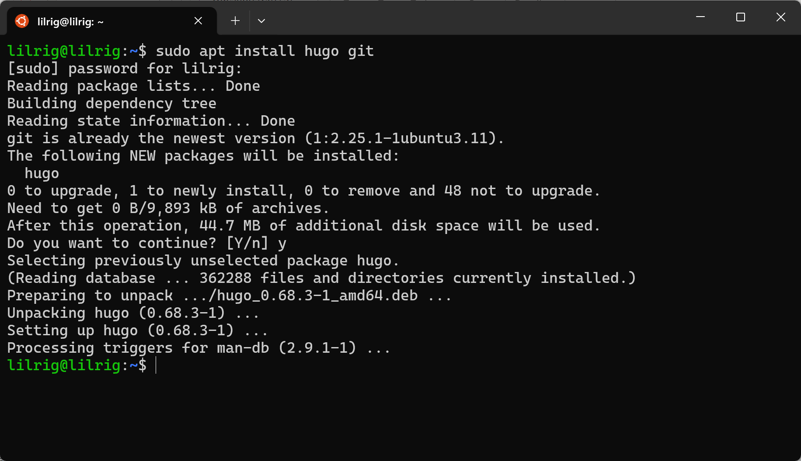


#### Change directory (cd) to where the website directory will be created
We will `cd` to the current user's home directory (the ~ tilde symbol is an alias for it) in the example. 
Select a directory name for your new site, in the example below it is `alexdarbyshire`.


#### Create the site and initiate a git repository
```
cd ~
hugo new site alexdarbyshire
cd alexdarbyshire
git init
```
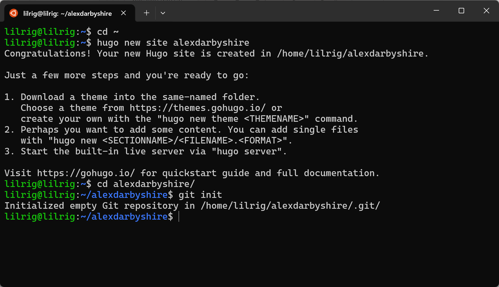


#### Install a theme
Here we use the [Hugo Universal Theme](https://github.com/devcows/hugo-universal-theme), the below commands are from their docs

```
cd themes
git clone https://github.com/devcows/hugo-universal-theme
cd ..
```
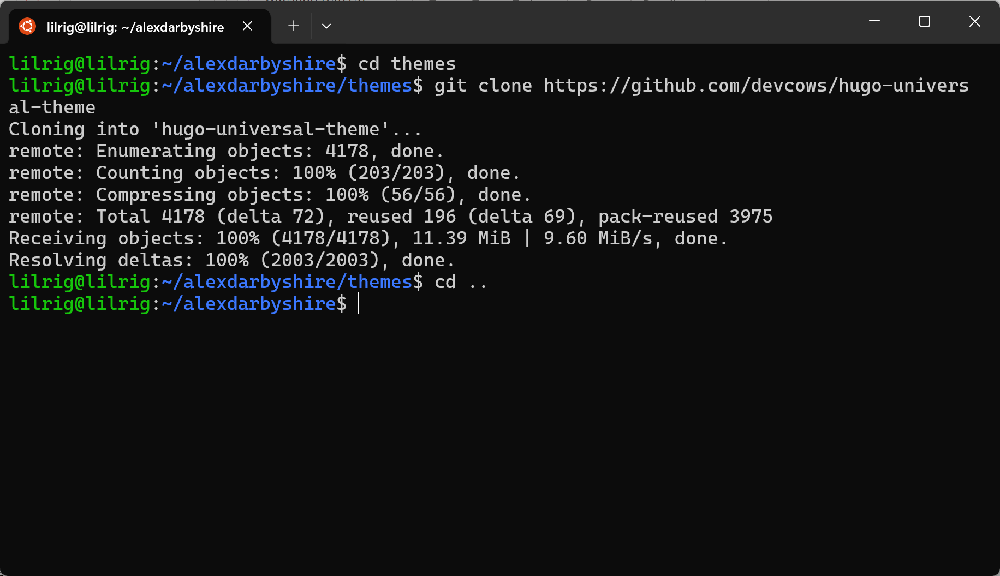

Optional - remove git from the theme allowing us to customise it without forking. There are other options here (submodules etc)

```
rm -rf themes/hugo-universal-theme/.git
```

#### Set the theme
Now we want to set the theme in the config.toml, we'll do this by appending to the end of this file rather than firing up a text editor

```
echo "theme = 'hugo-universal-theme'" >> config.toml
```
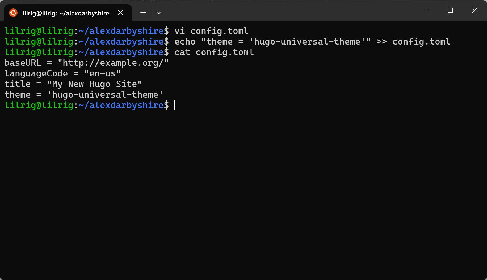


#### Test the site
Let's run the hugo server to see how we went. 
```
hugo server --bind 0.0.0.0
```
The `--bind 0.0.0.0` means any IP (that can reach the host) will be able to access the content.

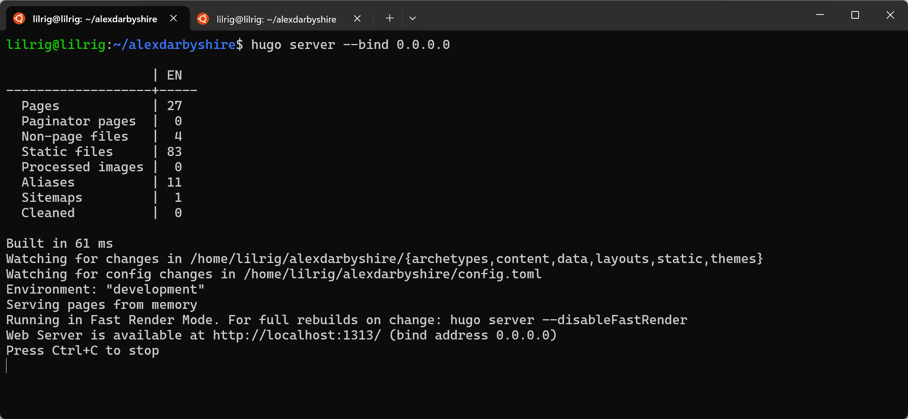

To check the content we'll either need another shell open on the same machine, or to know the IP of the VM and have network access to it from another computer which has a web browser.

- Using another shell on same machine
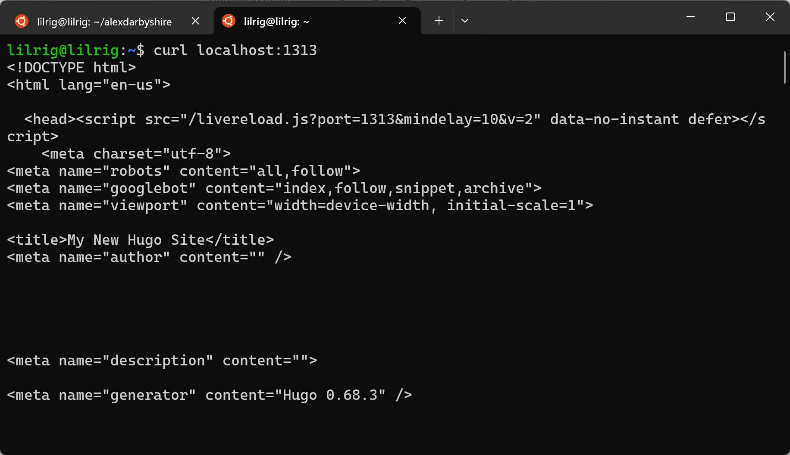
- Using a browser on a machine that has network access to the VM. Note, the IP shown starting with 192.168 is a range reserved for private networks - the IP will be different in your setup.
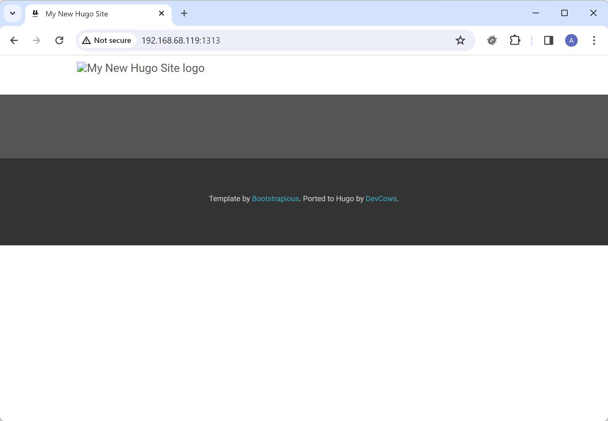

Success!

We will not get further into 'how to use Hugo', this working site is enough for proof-of-concept of the rest of the workflow. 

For more info on Hugo, [see their docs here](https://gohugo.io/documentation/), also see the [GitHub example](#Example) for this site at the time of the post.


### Turn the site into a Docker image
#### Create the definition of the website image for Docker
Create a file called `Dockerfile` in the website directory using you preferred text editor, if you don't have a preferred, use nano. 

The Dockerfile is the definition for the image we will build, it is sourced from the [Docker mods documentation](https://hugomods.com/docs/docker/#create-dockerfile) and modified.

The contents of the Dockerfile:
```
###############
# Build Stage #
###############

FROM hugomods/hugo:exts as builder
# Base URL
ARG HUGO_BASEURL
ENV HUGO_BASEURL=${HUGO_BASEURL}
# Hugo Environment
ARG HUGO_ENV
ENV HUGO_ENV=${HUGO_ENV}

# Build site
COPY . /src
RUN hugo --gc --enableGitInfo --minify

###############
# Final Stage #
###############
FROM hugomods/hugo:nginx
COPY --from=builder /src/public /site
```
This Dockerfile defines a multi-stage build process, first a container with Hugo is created and the hugo build command is run on the site we created. The static web content generated is then copied from the first image on top of a fresh image of Nginx (webserver in this use case) which becomes our new website image.

#### Build the Docker image
Build using the following command, note to update the build argument for HUGO_BASEURL to be your domain name. In the command, the `-t homelab/alexdarbyshire-site:latest -t homelab/alexdarbyshire-site:1` tags the image that is built with the namespace `homelab` the name `alexdarbyshire-site` and specifies version 1 as well as it being the latest version. In subsequent builds we would up the version number.
```
docker build --build-arg HUGO_BASEURL="https://www.alexdarbyshire.com" --build-arg HUGO_ENV=production -t homelab/alexdarbyshire-site:latest .
```
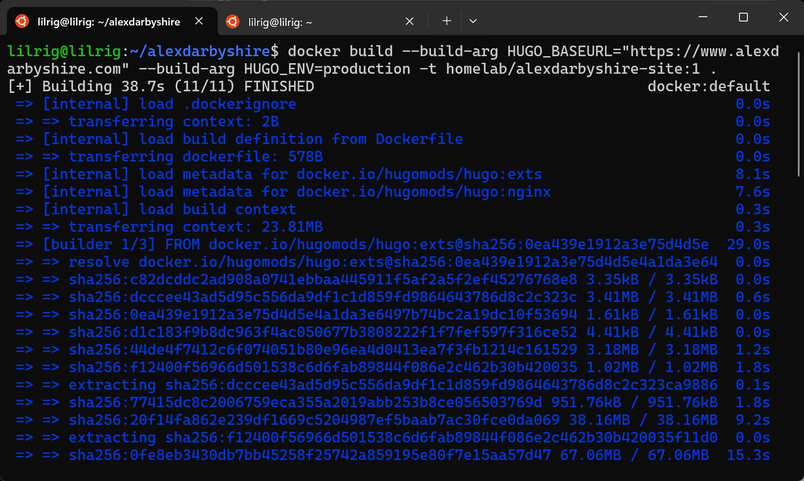
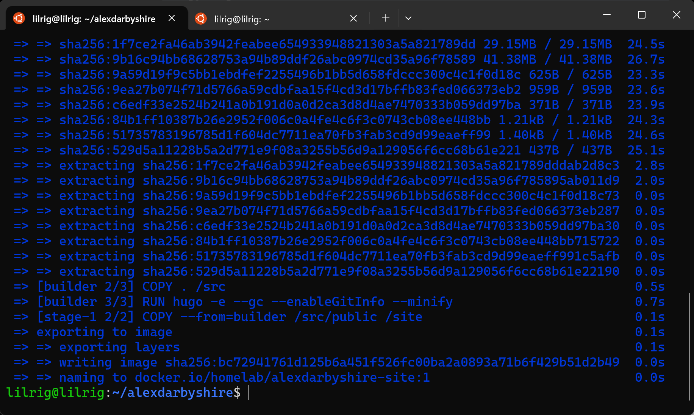
#### Test the image
```
docker run -p 8081:80 --name test-hugo homelab/alexdarbyshire-site:latest
curl localhost:8081
```
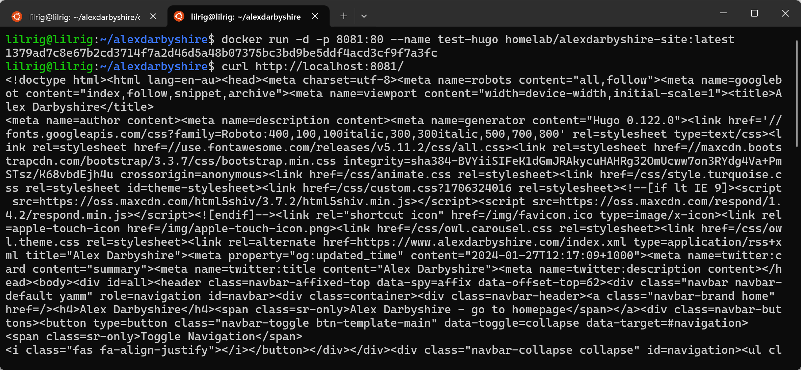

#### Stop and remove the image
```
docker stop test-hugo
docker rm test-hugo
```


### Setup a Cloudflare tunnel

#### Login to Cloudflare dashboard
Click the domain. If it is missing see [Bring Your Own](#Bring-Your-Own)
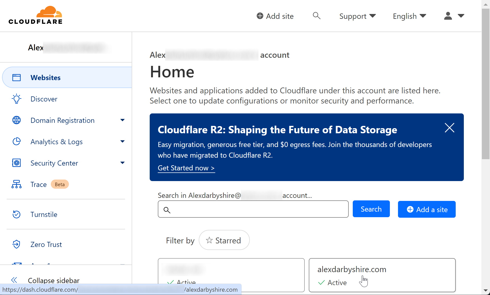

#### Click into `DNS` section
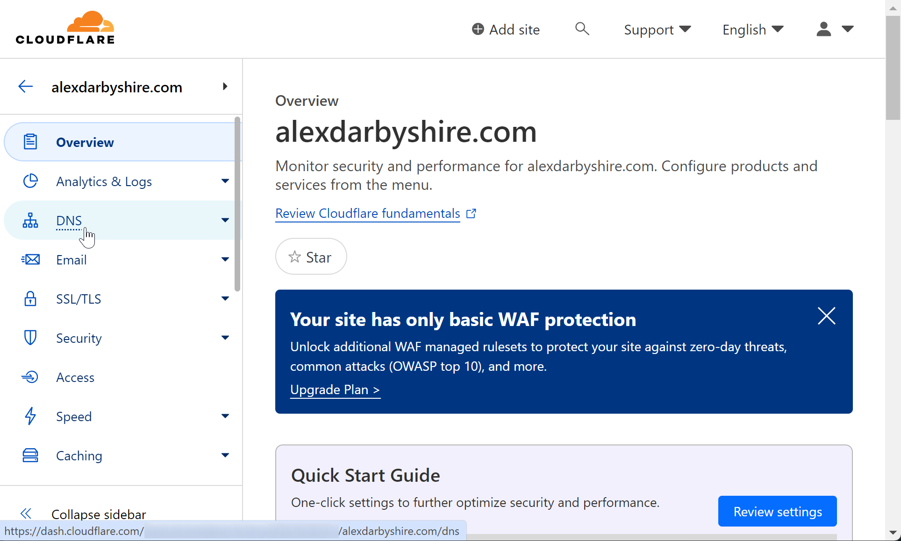

Within the domain's DNS check there aren't any CNAME records for yourdomain.com and www, if there are, delete them by clicking into `Edit` and then `Delete`.
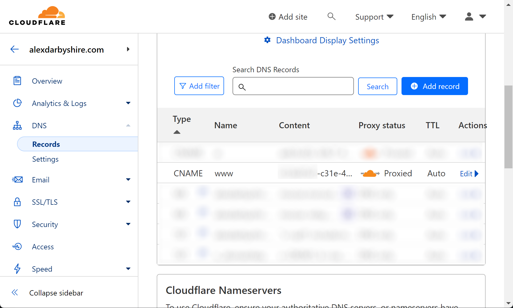

#### Click back button to get back to the dashboard
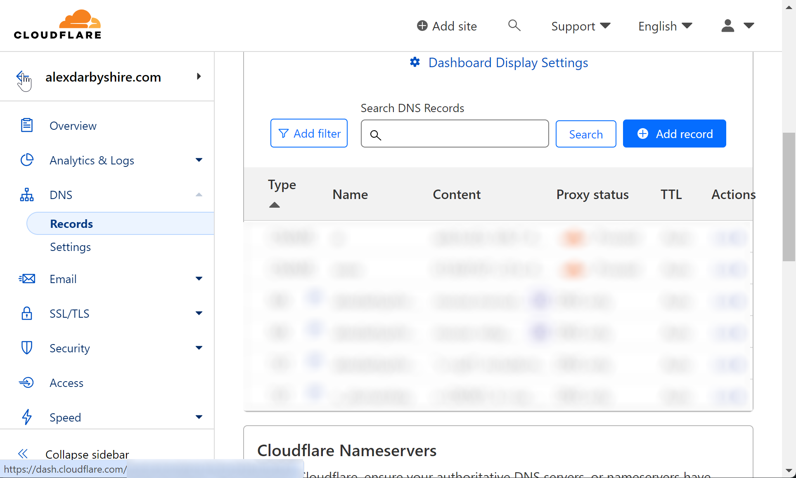

#### Click `Zero Trust`


#### Click `Tunnels` under Access
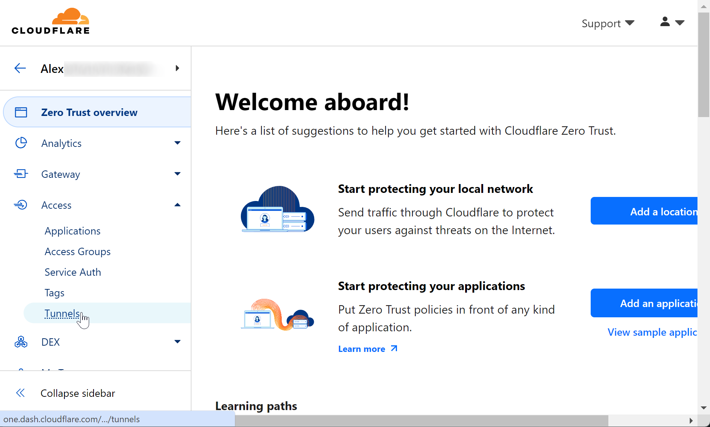

#### Create a tunnel
Give it any name to identify it
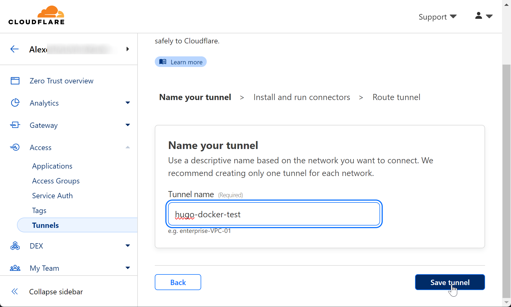


Under connectors, click docker and make note of the docker run command, we will use part of it in our docker-compose file
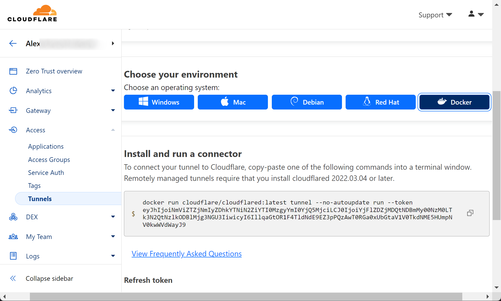


Click next and add a host for our domain, we will need to repeat this for our www subdomain (or use an A record if you are keen)
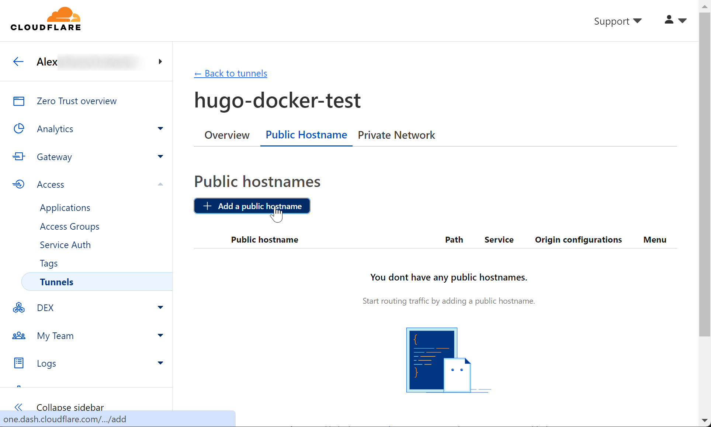

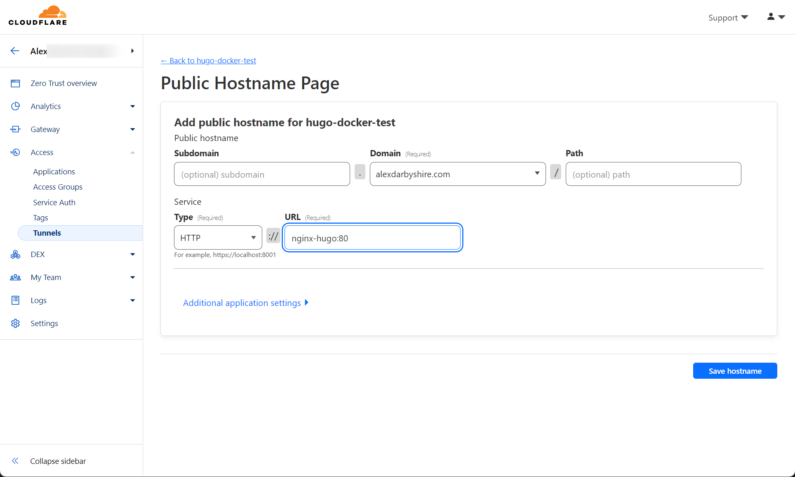


### Use Docker Compose to bring it all together
#### Create a `docker-compose.yml` file 
In the web directory folder. The service name of 'nginx-hugo' is important, it needs to be the same as the host we added in when creating the Cloudflare tunnel connector. Within the docker compose stack a network is created and the service name functions as a hostname, in other words the Cloudflared container uses the service name we used in the URL `http://nginx-hugo:80/` to talk to the Nginx container which serves the website.

If you are unfamiliar with YAML files, the indentation requirements are strict. Incorrect indentation will result in errors.

The contents of the docker-compose.yml file:
```
version: "3"
services:
  nginx-hugo:
  image: homelab/alexdarbyshire-site:latest
  container_name: nginx-hugo
  restart: always

  cloudflared:
    image: cloudflare/cloudflared:latest
    container_name: cloudflared-hugo
    restart: always
    environment:
        - CLOUDFLARE_TUNNEL_TOKEN=${CLOUDFLARE_TUNNEL_TOKEN} 
    command: tunnel --no-autoupdate run --token "$CLOUDFLARE_TUNNEL_TOKEN"
```
Using Docker secrets would be preferable to passing the token as an environment variable. However, the Cloudflared image isn't setup to read token from a file. It can be done using a custom Dockerfile for those who are keen. See https://gist.github.com/j0sh/b1971bfbbffeb92709cf096fb788f70

#### Create a `.env` file for the Cloudflare token
Create the file using you preferred text editor. 

Make sure to replace `insert_token_here` with the token from the Docker run command we noted when we created the tunnel, it was the long sequence of numbers are letters that follow `-token`

Contents of .env
```
CLOUDFLARE_TUNNEL_TOKEN=insert_token_here
```

#### Create a .gitignore file 
We will add two lines to prevent creds being added to repository, as well as the static website content
```
echo ".env" >> .gitignore
echo "public/" >> .gitignore
```

#### Bring up the stack
```
docker compose up -d
```
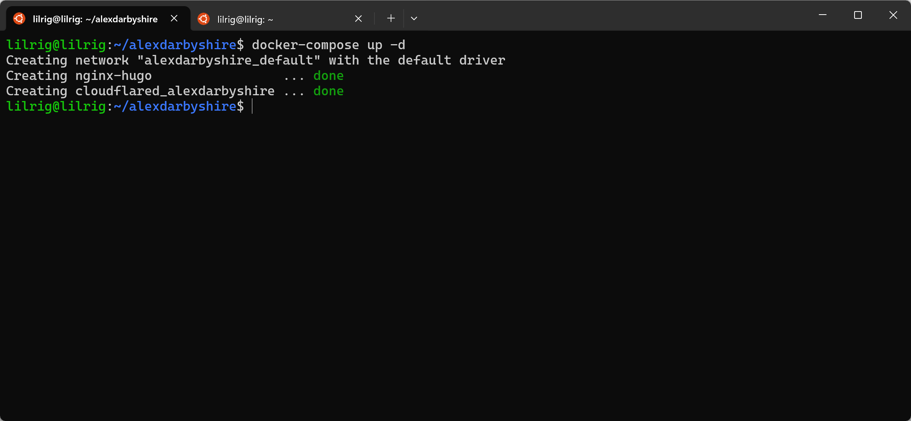


In Cloudflare, we should see the tunnel come online, this might take a minute.
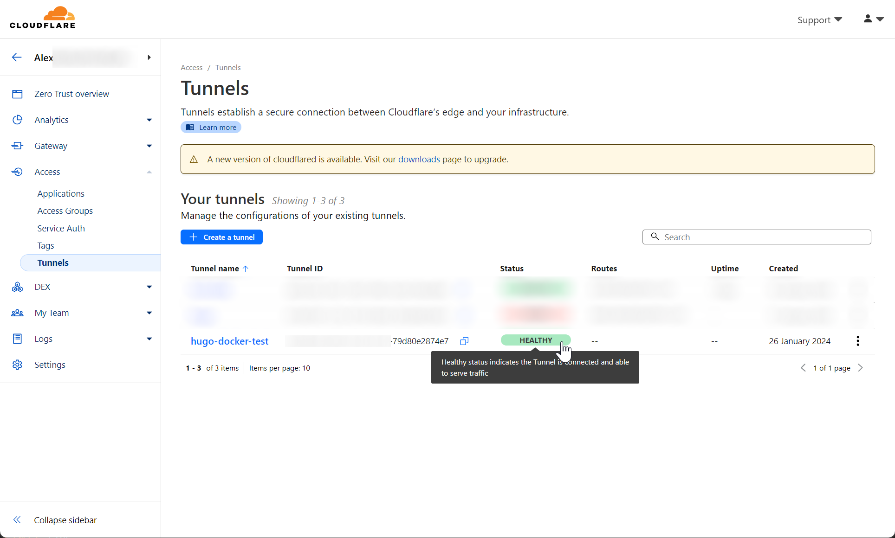


Now you should be able to access the site in your browser.
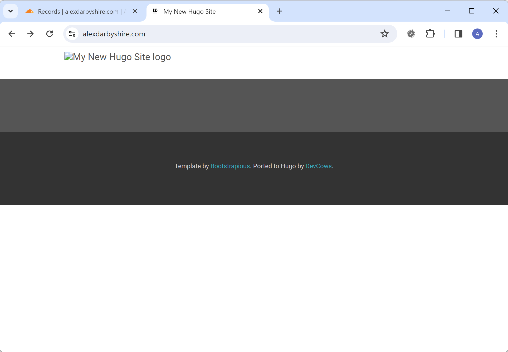
The above shows our end result, a self-hosted website accessed using a top-level domain in browser.


If you need to debug the containers, use the following command to see the logs:
e.g. for the nginx-hugo container
```
docker logs nginx-hugo 
```

#### Future builds
Now, any time the site is updated we can build a new version of the image and bring the docker stack up and down
```
docker build --build-arg HUGO_BASEURL="https://www.alexdarbyshire.com" --build-arg HUGO_ENV=production -t homelab/alexdarbyshire-site:latest .
docker compose down
docker compose up -d
```

#### Make a commit
You may want to commit your code to the local repo now.
```
git add .
git commit -m "Install and setup theme, create Dockerfile and docker-compose.yml for deploying site"
```

### A note on SSL
SSL is the s in `https` and handles encrypting traffic between web browsers and our host.

Cloudflare handles SSL certificates for us, however make sure that [SSL strict is enabled in Cloudflare](https://developers.cloudflare.com/ssl/origin-configuration/ssl-modes/full-strict/#process) for the domain.  

This ensures that anyone trying to access the `http` address will get redirected to the `https` address.

## Done
We give ourselves a pat on the back, relish the satisfaction of self-hosting, and then start thinking about all the ways we could improve and automate this process. To be continued in a series of follow-up posts...

