This post will explore deploying Hashicorp Vault to K3s (Kubernetes distribution) using Helm and then configuring it with Terraform. This will enable us to store our secret state data in Vault and make those secrets available to our K3s resources.

Vault is an enterprise level secrets manager configurable for high availability which integrates with Kubernetes and many CI toolsets.

In the previous two posts journaling the evolution of this site's delivery, we have been managing a single secret, the Cloudflared tunnel token.

This secret has extended our process in both posts in taking precautionary steps not to include it in source control.

The prior approach was having an `.example` secret state file, adding the actual file to `.gitignore`, and documenting instructions on creating the real file manually. This becomes increasingly cumbersome and error-prone with the more secrets we add.

Using Vault for one secret is like dropping a shipping container of hammers onto a small nail to hit the nail in. This post is about learning to use the tools, for the example use case there are more elegant solutions.

Note, we are building upon the [previous post]( "Migrating from Docker Compose to Kubernetes (K3s)") which got our [GitHub repo to here.](https://github.com/alexdarbyshire/alexdarbyshire.com/tree/e289cae54d452745e30cf733e06c0b3c569adaec)

## Example
[Checkout the end result in GitHub](https://github.com/alexdarbyshire/alexdarbyshire.com/tree/5bb6d8bc540f5494610c00e6fa5ffd4203246dbf) 

## References
[Vault docs for installing on Minikube](https://developer.hashicorp.com/vault/tutorials/kubernetes/kubernetes-minikube-consul) - followed this closely up until using Terraform. 

It goes into more detail about what the steps prior to Terraform are doing.

## Tech Stack

- **K3s**
- **Ubuntu Linux**
- **Helm**
- **Hashicorp Vault**
- **Consul**
- **Terraform**

## Bring Your Own

- **Host running Ubuntu Linux**
    - e.g. VirtualBox VM, Bare metal host, Virtual Private Server (VPS), WSL2  
- **K3s installed on host**

## Steps

### Install Helm 
#### Install Helm and jq
```bash
sudo snap install helm --classic
sudo apt install jq
```
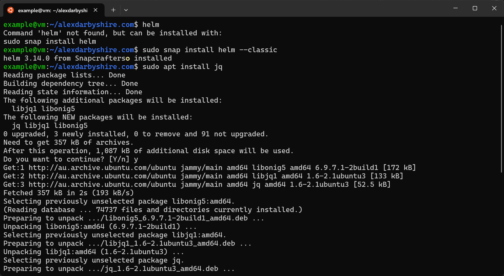

jq is a small command line tool for parsing JSON in shells, we use it later with some JSON output from Vault.

#### Set KUBECONFIG Environment Variable
We need to let Helm know where to find the kube config file. 

We could do this for the session only, or a specific user, or all users. Here we have gone for setting it system-wide.
```bash
echo "KUBECONFIG=/etc/rancher/k3s/k3s.yaml" | sudo tee -a /etc/environment
echo /etc/environment
```
The shell will need to be renewed for the added environment variable to take effect. When using SSH, `exit` and reconnect will work.

Note we used piped the stdout of the `echo` command to `sudo tee` instead of the shorthand `>>` append operator as the shorthand will not work when the executing user doesn't have write permissions for the file. 

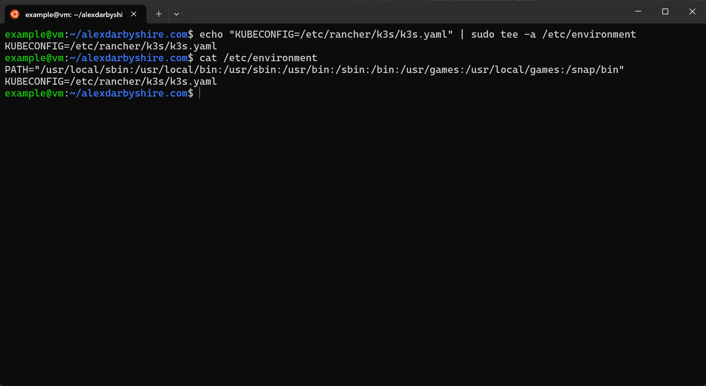

##### Alternative option for KUBECONFIG
This method exports a copy of the kube config to the user's home directory and adds the KUBECONFIG environment variable for the user. 

This way `sudo` is no longer needed to run `kubectl` as it no longer needs access to `/etc/rancher/k3s/k3s.yaml`.
```bash
mkdir ~/kube
sudo k3s kubectl config view --raw > ~/.kube/config
chmod 600 ~/.kube/config
echo "export KUBECONFIG=~/.kube/config" >> ~/.profile
```


### Setup Vault and Consul
#### Add and Update Hashicorp Helm Repository
```bash
sudo helm repo add hashicorp https://helm.releases.hashicorp.com
sudo helm repo update
```
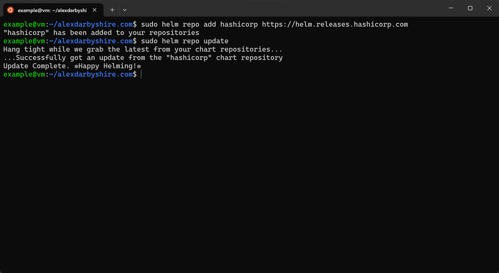
#### Add Helm Value File for Consul
Create a file `deploy/helm-consul-values.yaml` with contents:
```yaml
global:
  datacenter: vault-kubernetes

client:
  enabled: true

server:
  replicas: 1
  bootstrapExpect: 1
  disruptionBudget:
    maxUnavailable: 0
```
The Helm chart for Consul accepts these parameters.

#### Add Helm Value File for Vault
Create a file `deploy/helm-vault-values.yaml` with contents:
```yaml
server:
  affinity: ""
  ha:
    enabled: true
```

#### Install Consul and Vault
```bash
sudo helm install consul hashicorp/consul --values deploy/helm-consul-values.yaml
sudo helm install vault hashicorp/vault --values deploy/helm-vault-values.yaml
```
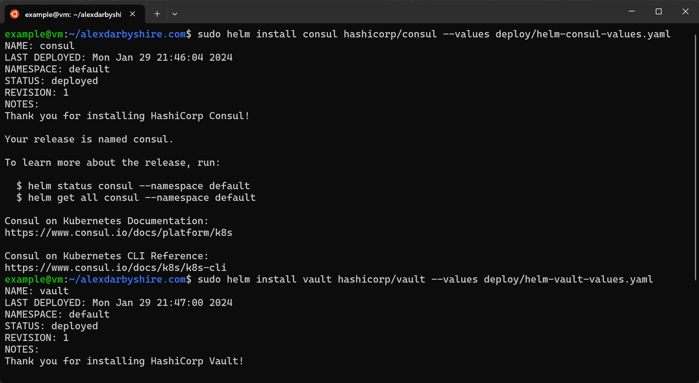

#### Check the Pods
```bash
sudo k3s kubectl get pods
```


We can see our Vault pods aren't ready.

Execute a command in one of the Vault pods to get Vault's status
```bash
sudo k3s kubectl exec vault-0 -- vault status
```
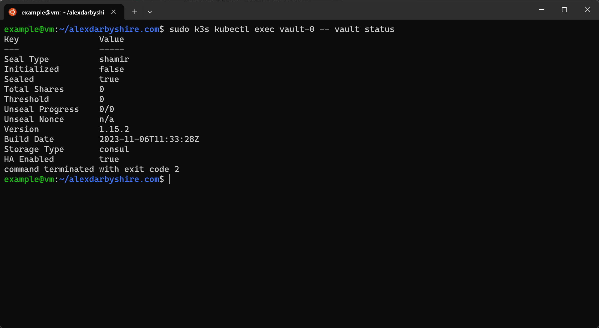
We need to initialise and unseal the Vault.

### Configure Vault
#### Initialise Vault and Generate Unseal Keys
We'll set the number of keys generated and the number of keys required to unseal to 2 and output those keys to a JSON file.

```bash
sudo k3s kubectl exec vault-0 -- vault operator init -key-shares=2 -key-threshold=2 -format=json > cluster-keys.json
```
Here is what the outputted file looks like:
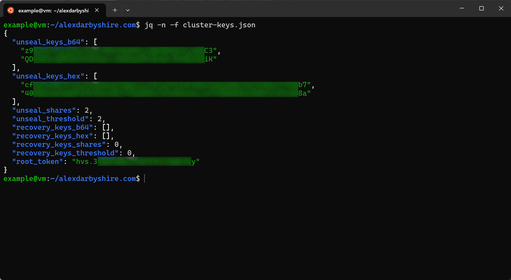

#### Unseal the Vault
We want to read the keys out of the JSON and pass them to Vault. We could do something like
`sudo k3s kubectl exec vault-0 -- vault operator unseal $(jq -r '.unseal_keys_b64[0]' cluster-keys.json)`

This would keep the keys out of our bash history, it could expose keys to other users on the host who are monitoring processes.

Instead we'll use xargs to positionally apply the piped out of jq. Note to self, come back and refactor this.
```bash
jq -r '.unseal_keys_b64[0]' cluster-keys.json | xargs -I {}  sudo k3s kubectl exec vault-0 -- vault operator unseal "{}"
jq -r '.unseal_keys_b64[1]' cluster-keys.json | xargs -I {}  sudo k3s kubectl exec vault-0 -- vault operator unseal "{}"
jq -r '.unseal_keys_b64[0]' cluster-keys.json | xargs -I {}  sudo k3s kubectl exec vault-1 -- vault operator unseal "{}"
jq -r '.unseal_keys_b64[1]' cluster-keys.json | xargs -I {}  sudo k3s kubectl exec vault-1 -- vault operator unseal "{}"
jq -r '.unseal_keys_b64[0]' cluster-keys.json | xargs -I {}  sudo k3s kubectl exec vault-2 -- vault operator unseal "{}"
jq -r '.unseal_keys_b64[1]' cluster-keys.json | xargs -I {}  sudo k3s kubectl exec vault-2 -- vault operator unseal "{}"
```
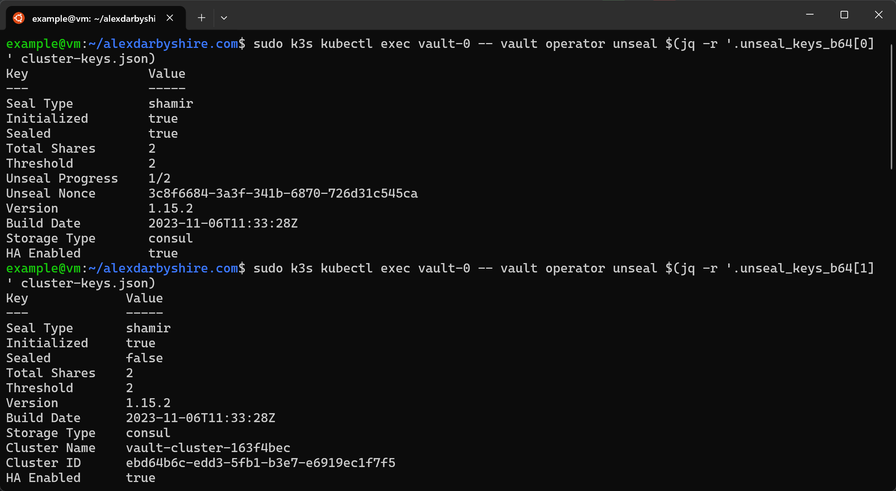

Make note of the root_token in the cluster-keys.json, we'll use it shortly.

**Note:** Now that we have unlock the keys for the first time, take the contents of the `cluster-keys.json` and put it somewhere safe like a decent password manager with multifactor authentication enabled. If it was for something sensitive, use increased and appropriate precautions commensurate to risk.

Then after making a copy of the contents, I suggest getting rid of the file, `rm cluster-keys.json`

Checking the pods now should have them all showing as available.

### Configure Terraform 
Originally intended to leave Terraform for a later post and using Vault `.hcl` files and the command line, then this post would have been very similar to Vault's minikube tutorial.

On reflection, we may as well get started with Terraform now.

#### Install Terraform
Add the package repositories key, and use the apt package manager to install Terraform.
```bash
wget -O- https://apt.releases.hashicorp.com/gpg | sudo gpg --dearmor -o /usr/share/keyrings/hashicorp-archive-keyring.gpg
echo "deb [signed-by=/usr/share/keyrings/hashicorp-archive-keyring.gpg] https://apt.releases.hashicorp.com $(lsb_release -cs) main" | sudo tee /etc/apt/sources.list.d/hashicorp.list
sudo apt update && sudo apt install terraform
```


#### Create the Terraform files for configuring Vault
There are a few files to create, rather than list all contents here, [click this link to the GitHub repo](https://github.com/alexdarbyshire/alexdarbyshire.com/tree/5bb6d8bc540f5494610c00e6fa5ffd4203246dbf).

- main.tf - defines the Vault provider to inform Terraform of how to interact with the rest of the files
- secrets.tf - enables kv-v2 (Key Value) secret engine
- auth.tf - enables Kubernetes auth backend and add a service-account for cloudflared with the required policy to allow access to the secrets intended path
- policies.tf - Barrel file that specifies which Vault policies (in Vault's standard `.hcl` format) should be loaded
- polices/cloudflared-policy.hcl - a policy to allow CRU (Create, Read, Update) access to cloudflared path in enabled secrets engine


#### Provision Vault
Temporarily expose the Vault management port the host, run this in a second shell as it runs in the foreground (or run in background using screen or similar and remember to kill it).
```
sudo k3s kubectl port-forward vault-0 8200:8200
```


Set the resulting address as the standard `VAULT_ADDR` environment variable, set the token as an environment to give Terraform the address and the door pass. 

**Security** This will expose the token in the shell history and in memory on the host.  

Then initialise the Terraform with the Vault provider, and apply the config.

```bash
export VAULT_ADDR="http://127.0.0.1:8200"
export VAULT_TOKEN=insert_the_root_token_we_got_from_cluster-keys.json
terraform init
terraform apply
```


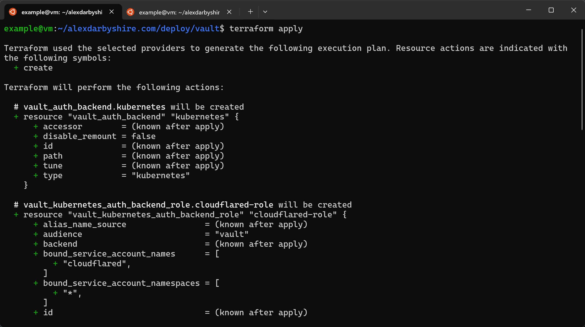

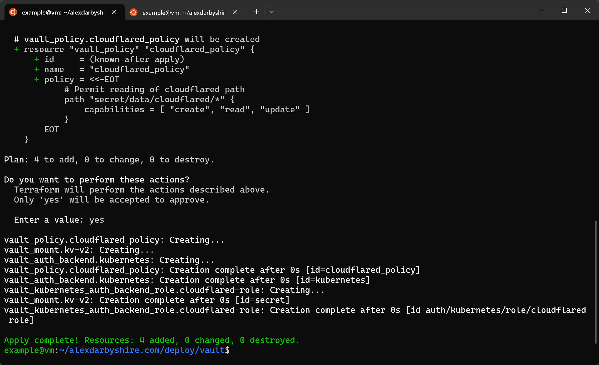

#### Add Cloudflared Token to Vault
We still do this step manually as we don't want to add credentials to the Terraform files. 

Remember that we base64 encoded the token before adding it to our `.env` file, so if sourcing it from there decode it `echo "token_here" | base64 -d` or just get the original from the Cloudflare UI.

```bash
sudo k3s kubectl exec --stdin=true --tty=true vault-0 -- /bin/sh
vault login
vault kv put secret/cloudflared/tunnel token="insert_cloudflared_tunnel_token"
```
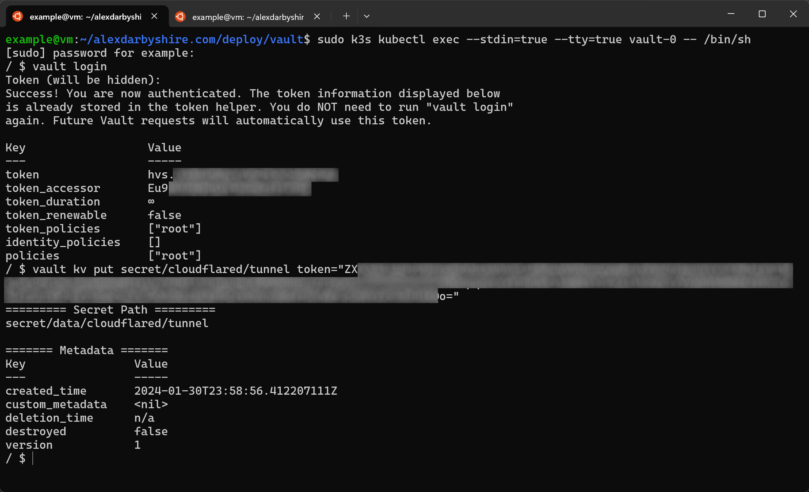


#### Confirm Terraform success
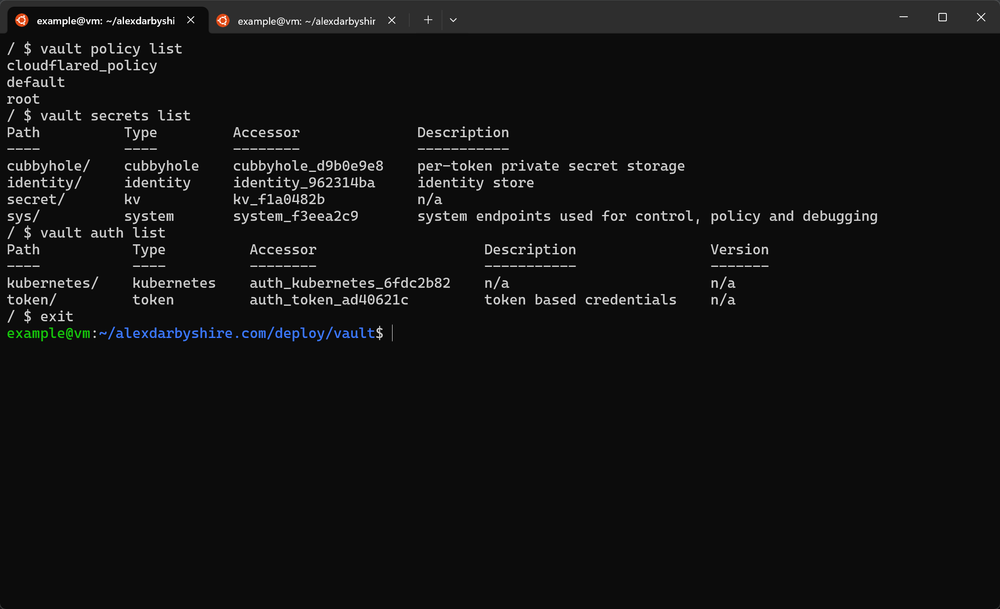

### Add Secret to Vault and Retrieve
In the section we bring it all together by implementing a Vault sidecar service to inject our secret as the `TUNNEL_TOKEN` environment variable.

There is a slight challenge to solve in doing this. The stock Cloudflared image does not have a shell and to inject environment variables from Vault into pods we need a shell. Also, the cloudflared application does not allow reading the token from a file.

Three solutions come to mind:
1. Create our own image with the cloudflared application and a shell.
2. Re-work our use of Cloudflared to use a tunnel credentials file, the cloudflared application has a param for reading these from the file system.
3. Create an init container which reads the injected secret and then adds it to the K3s secrets engine (which can then be set as an environment variables without a shell)

Will use method 3 for now. In a future post we might look at using the Cloudflared API via Terraform or directly to get our tunnel creation included as part of config as code.


#### Move Helm config files
These are mixed up with our Kubernetes files, moving them to their own directory will make life easier.
```bash
mkdir helm
mv helm-* helm/
```
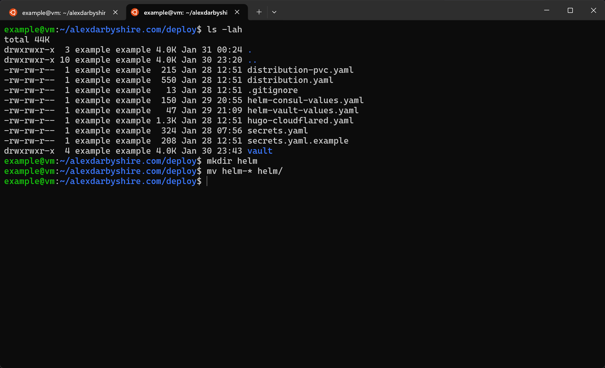

#### Add K3s service account and secret

Add file `deploy/vault-auth-service-account.yaml` with the following content:

```yaml
apiVersion: v1
kind: ServiceAccount
metadata:
  name: vault-auth
  namespace: default
---
apiVersion: rbac.authorization.k8s.io/v1
kind: ClusterRole
metadata:
  name: secret-admin
rules:
  - apiGroups: [""]
    resources: ["secrets"]
    verbs: ["create", "get", "watch", "list", "patch", "delete"]
---
apiVersion: rbac.authorization.k8s.io/v1
kind: ClusterRoleBinding
metadata:
  name: role-tokenreview-binding
  namespace: default
roleRef:
  apiGroup: rbac.authorization.k8s.io
  kind: ClusterRole
  name: system:auth-delegator
subjects:
  - kind: ServiceAccount
    name: vault-auth
    namespace: default
---
apiVersion: rbac.authorization.k8s.io/v1
kind: ClusterRoleBinding
metadata:
  name: role-secretadmin-binding
  namespace: default
roleRef:
  apiGroup: rbac.authorization.k8s.io
  kind: ClusterRole
  name: secret-admin
subjects:
  - kind: ServiceAccount
    name: vault-auth
    namespace: default
---
```

This: 
- creates a service account called vault-auth, 
- creates a role called secret-admin which can administer Vault secrets,
- binds two roles to service account
  - an inbuilt role `system:auth-delegator` which will provide a short-lived Vault token inside any pods with the service account, and
  - the secret-admin role we created.

Add file `deploy/vault-auth-secret.yaml` with the content:

```yaml
apiVersion: v1
kind: Secret
metadata:
  name: vault-auth-secret
  annotations:
    kubernetes.io/service-account.name: vault-auth 
type: kubernetes.io/service-account-token
```

Apply the new manifests.
```bash
sudo k3s kubectl apply -f vault-auth-service-account.yaml,vault-auth-secret.yaml
````


#### Update Cloudflared Manifest to use secret from Vault
We'll use [a Vault Agent Sidecar](https://developer.hashicorp.com/vault/docs/platform/k8s/injector/examples#deployments-statefulsets-etc) and a few tricks to inject the Cloudflared tunnel token into our Cloudflared pods as an environment variable.

We will also improve our Cloudflared K3s deployment definition which is pretty basic after using Kompose to migrate, e.g. it doesn't have a healthcheck.

The sidecar is configured using annotations in the Deployment manifest's template key. 

The injected secret is accessible through a pod's filesystem. We use an initContainer to get the secret from the filesystem and add it in to K8s secret store to allow it to be loaded as an environment variable before the cloudflared container starts. 

There is a bit of added complexity with Cloudflared not having a shell and not accepting the tunnel token from a file. Will definitely be looking at using a Cloudflare credential file type workflow in future.

In `deploy/hugo-cloudflared.yaml`, update the Cloudflared deployment section to:
```yaml
apiVersion: apps/v1
kind: Deployment
metadata:
  labels:
    app: cloudflared
  name: cloudflared-deployment
spec:
  replicas: 2
  selector:
    matchLabels:
      app: cloudflared
  template:
    metadata:
      labels:
        app: cloudflared
      annotations:
        vault.hashicorp.com/agent-inject: 'true'
        vault.hashicorp.com/agent-init-first: 'true'
        vault.hashicorp.com/role: 'cloudflared-role'
        vault.hashicorp.com/agent-inject-secret-token: 'secret/cloudflared/tunnel'
        vault.hashicorp.com/agent-inject-template-token: |
          {{- with secret "secret/cloudflared/tunnel" -}}
            export TUNNEL_TOKEN="{{ .Data.data.token }}"
          {{- end }}
    spec:
      serviceAccountName: vault-auth
      initContainers:
      - image: docker.io/alpine/k8s:1.25.6
        name: create-auth-token
        command:
            - /bin/sh
            - -c
            - |
              source /vault/secrets/token
              kubectl delete secret cloudflared --ignore-not-found > /dev/null 2>&1
              kubectl create secret generic cloudflared --from-literal="token=$TUNNEL_TOKEN"

      containers:
      - image: cloudflare/cloudflared:latest
        name: cloudflared
        args:
        - tunnel
        - --no-autoupdate
        - --metrics=0.0.0.0:3333
        - run
        - tunnel
        env:
          - name: TUNNEL_TOKEN
            valueFrom:
              secretKeyRef:
                name: cloudflared
                key: token
        livenessProbe:
          httpGet:
            path: /ready
            port: 3333
            scheme: HTTP
        readinessProbe:
          httpGet:
            path: /ready
            port: 3333
            scheme: HTTP
        startupProbe:
          httpGet:
            path: /ready
            port: 3333
            scheme: HTTP
          failureThreshold: 60
          periodSeconds: 10
      restartPolicy: Always
---

apiVersion: apps/v1
kind: Deployment
metadata:
  labels:
    app: nginx-hugo
  name: nginx-hugo-deployment
spec:
  replicas: 1
  selector:
    matchLabels:
      app: nginx-hugo
  template:
    metadata:
      labels:
        app: nginx-hugo
    spec:
      containers:
      - image: localhost:5000/alexdarbyshire-site:latest
        name: nginx-hugo
        ports:
          - containerPort: 80
      restartPolicy: Always

---

apiVersion: v1
kind: Service
metadata:
  name: nginx-hugo
spec:
  selector:
    app: nginx-hugo
  ports:
    - protocol: TCP
      port: 80
      targetPort: 80
---
```

#### Patch the resource and check the pods

```yaml
sudo k3s kubectl patch -f hugo-cloudflared.yaml
```


Looks good. We can double-check Nginx is receiving requests by browsing to the site and then checking pod logs. 
```
sudo k3s kubectl logs -f *name_of_pod*
```


Success!

### Cleanup
```bash
rm secrets.yaml
rm secrets.yaml.example
```

#### Make a commit

```
git add .
git commit -m "Add Vault for secrets management"
```

#### Done. 
Time to start thinking about the next project. 
