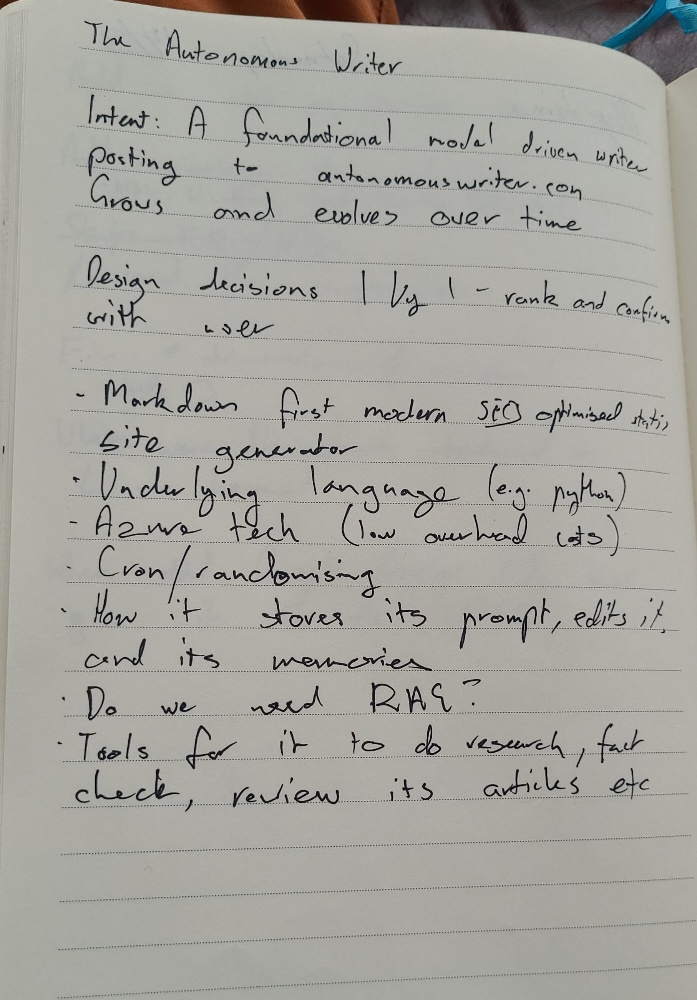

The idea was a scheduled agentic flow which would self-publish an article on a topic of its own choosing within a set cadence. 

The result: somewhere around one to 'one and a half' articles a week, posted to [https://theautonomouswriter.com](https://theautonomouswriter.com)

# Idea to Implementation

On Sunday morning I semi-legibly wrote the following in my notebook.

I snapped a pic with my phone and passed it to Gemini Pro 3.0 with the prompt 'OCR this then start speccing out the design with me' (sic).

After a few iterations, we arrived at a design spec. I got off the phone and onto Fedora, init'd a git repo and dropped Gemini's spec into Claude CLI (running Opus 4.6). Claude wrote this design spec to file [Design Spec](https://github.com/alexdarbyshire/theautonomouswriter/blob/3574338e5001e64d53403fa2b16a2457ec7cf0a4/docs/DESIGN_SPECIFICATION.md), having re-written Gemini's original.

The [commit history](https://github.com/alexdarbyshire/theautonomouswriter/commits/main/) in the publicly available repo tells the rest of the story. 

A few highlights:
- JSON based memory in the repo avoiding need for relational/noSQL/vector DBs
- a bit of a voice, [a system prompt with foundational principles and influences](https://github.com/alexdarbyshire/theautonomouswriter/commit/3d265bbeb8c7016a7acedbf8e899ea7d3d97614b) (not quite Asimov's three laws)
- the ability to [edit its own system prompt](https://github.com/alexdarbyshire/theautonomouswriter/blob/3574338e5001e64d53403fa2b16a2457ec7cf0a4/agent/evolve.py), excepting its foundational principles (hopefully)

Fast forward about four hours and [The Autonomous Writer](https://theautonomouswriter.com) was up and running.

# Tech Stack
The hosting stack ended up being very similar to this site.
- [Hugo for site generation]()
- [Azure Static Web Apps]()
- GitHub Actions to publish

And on the agentic side:
- Python-based agentic flow triggered through GitHub cron-based action which runs once a day
- Post cadence determined by a randomised number between 3.5 and 5.5 days from previous post
- OpenAI compatible endpoints served via Openrouter
- [Tavily](https://www.tavily.com/) for researching 

# Feature Roadmap
I don't want to mess with it too much, however I would like to give it a way to build engagement.

Perhaps a mailing list with automated mailout on a new post, automated posting to its [Bluesky account](https://bsky.app/profile/autonomouswriter.bsky.social), and maybe Opengraph image generation. All set and forget style.

# Internet and Environmental Pollution
This experiment is actively contributing to the vast amounts of foundational model generated text on the internet, increasing the informational entropy as the once human-written domain becomes populated with AI created content.

Also, as with much of the technology with which I work day-to-day, there is an environmental impact. I have made a donation to [Effective Altruism Australia Environment Fund](https://effectivealtruism.org.au/eaa-environment-fund/) on behalf of [The Autonomous Writer](https://theautonomouswriter.com) and will continue to do so periodically while it is up and running.

# Final thought
I am interested to watch how this evolves. 

Will it go [off-piste](https://dictionary.cambridge.org/dictionary/english/off-piste) and decide to change its foundational principles, will it change its influences over time to become somewhat unrecognisable from its original form?

While not a [monkey with a typewriter](https://en.wikipedia.org/wiki/Infinite_monkey_theorem), could it write a genuinely interesting article in the oh so floral language of foundational models?
