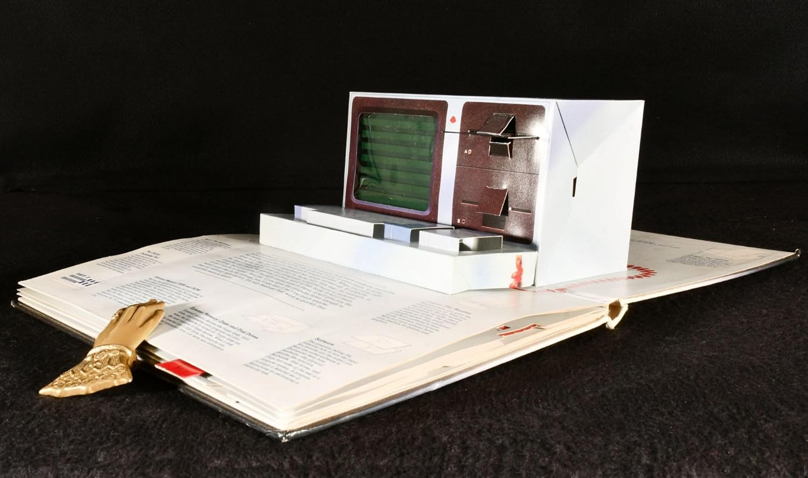
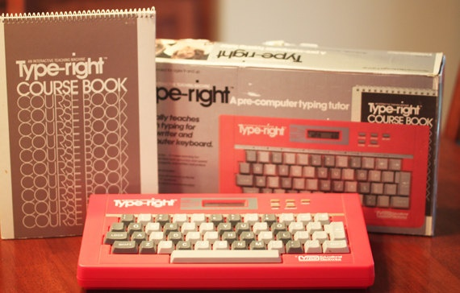
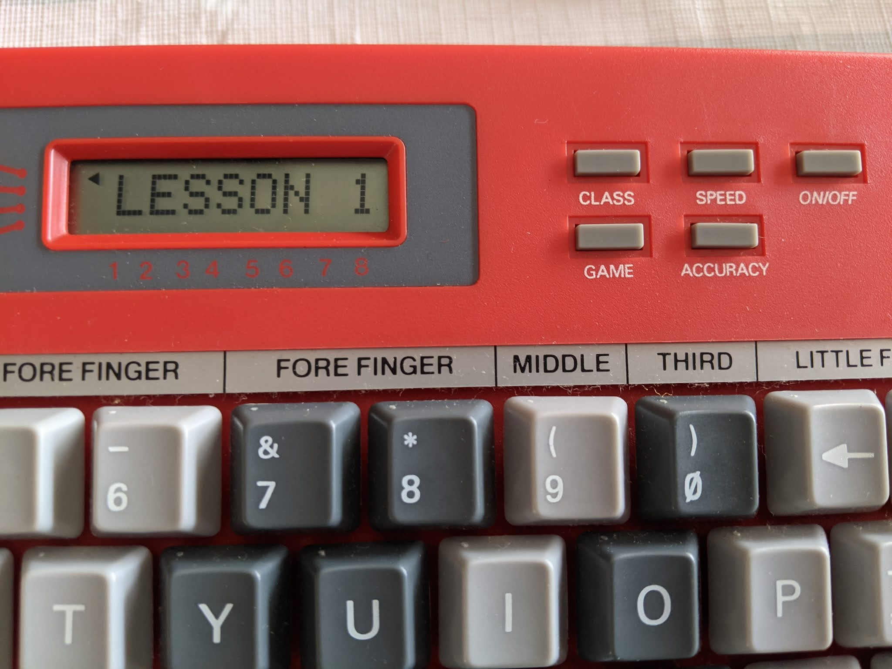

---
title: "Vim Keybindings as a Source of Flow"
date: 2026-02-25T09:06:00+10:00
author: "Alex Darbyshire"
slug: "vim-keybindings-as-a-source-of-flow"
toc: true
tags:
  - Vim
  - Flow
  - Productivity
  - Learning
---

This post explores using Vim keybindings as a source of flow.

Vim key-bindings are a set of keyboard shortcuts from the Vi text editor which allow you to navigate and edit text without using a mouse or arrow keys. They can be used either natively or by extension in Bash terminals, the Vim text editor, IDEs such as VSCode and the IntelliJ series, NeoVim, Obsidian, and Claude Code.

## The Subjective Nature of Tool Choice

Firstly, does one need Vim keybindings to program effectively? No.

And, as to which keybindings are better, Vim, Emacs etc - it is of little relevance to the topic (and subjective). That is not [a hill worthy of slipping the mortal coil](https://en.wiktionary.org/wiki/hill_to_die_on).

The underlying ideas in this post are applicable to any type of key-bindings.

Does choosing or not choosing to learn old school keybindings reflect on you as a person or a professional in any meaningful sense - no.

We have finite attention, learning Vim keybindings is an allocation of your attentional capacity. There is a vast selection of practices to choose from and it is up to the individual to deem a practice worthwhile.

## Flow State and the Plateau

A primer on flow: The flow state was coined and popularised by Mihaly Csikszenthmihalyi. His book, 'Flow: The Psychology of Optimal Experience' is a worthwhile read. After hearing the term often in relation to programming and feeling I had a good grasp on what it was, I was pleasantly surprised to find the book to much more encompassing than expected. It is a treatise on how to approach life.


One of the underlying ideas of the flow state is in Flow we seek ever increasing complexity as our abilities develop thereby continuously growing.

Working with code daily, we can reach a point of comfort. Perhaps design patterns come naturally to you, you intuit an error's source before reading the stack trace, your kubectl 'twenty questions' is more like two and your output now is governed more by time than the expanding limits of your knowledge.

## My Vim Journey: From Frustration to Flow

When I started practicing Vim Keybindings, I found them frustrating and limiting. Emphasis on the frustrating. I would say for quite some time that I didn't find any flow, and my output was reduced.

I was changing the way I interacted with a computer. A pattern established over 35 years perhaps 30 of which I had been touch-typing for, having learned at the tender age of eight.

### A Brief Detour: Keyboard Archaeology

Consider for a moment where and when you learned to use a keyboard. What type of keyboard was it. Was your body the same size it is now, how old are those postural habits. How hard do you hit the keys. What operating system was it. 

Let's segue down memory lane for a moment.

My first computer was a children's book, each with a page describing the componentry of a computer and final page with fully-fledged pop-up paper computer.



**[Inside the Personal Computer (1984), An Illustrated Introduction in 3 Dimensions](https://www.computinghistory.org.uk/det/42165/Inside-the-Personal-Computer-An-Illustrated-Introduction-in-3-Dimensions/)** *Abbeville Press Inc., New York*

My first computer with actual logic gates was a 386SX running MS-DOS 3.1 circa 1991 (soon upgraded to MS-DOS 5.0 which came with QBasic - woot) - I would have typed key by key until about 1994.

At primary school, Grade 4s and up had typing time on these fairly well-worn machines called a Type-right.


{.center}

The Type-right had in-built lessons and feedback all on its tiny dot-matrix screen. In Grade 3, I requested special dispensation from our Principal to start early and was allowed to take one home over the course of several weeks. Early flow. I got half-decent over the next few years, my WPM and accuracy was probably better then than it is now.



As a result of learning on these well-used machines, I really bang the keys, although maybe not quite as hard as someone who learnt on an Underwood. I also built the neural pathways when my body was a different shape, and posturally a fair bit of my computer use involved getting up early on the weekend and building a makeshift blanket fort in front of one to play games for extended periods.

### Back to Vim: The Learning Curve

Right, now back to the more recent past and learning Vim. Despite the emphasised frustration, I persevered. From memory, the first 4 or 5 posts of this blog were written in Vim running as an interactive process executed from a Bash terminal. This was when it was just plain hard with little to no joy to be found.

Within the flow state growth graph, I was solidly up the y axis (Challenge) and very much at the beginning of the x axis (Skill).


*Generated by Nana Banana Pro - based on Mihaly Csikszenthmihalyi's work*

I installed the plugins on my favourite IDEs and kept trying. I played with registers (think clipboard history), told my colleagues about the new game I had set myself, and laid new neural pathways.

Within a few weeks, the dopamine releases associated with the skill development reward pathways started firing occasionally and the frustration was at least somewhat offset.

### Finding Balance: Two Years Later

Now as I write this, it is two years later and I am using Vim keybindings. I am by no means a Vim master.

I went less strict and use some hybrid - specifically the ol' copy and paste Ctrl-C and Ctrl-V proved difficult to mentally unwire (and are useful for their cross-app capabilities in my employer's chosen Windows environment), I use them and the Windows 11 clipboard history in addition to Vim's registers.

I go through periods of just 'using what I know' and some of 'continuing to grow'. In the latter, I find myself looking forward to a good opportunity to use substitution with regex and capture groups. In the former, I still sometimes get a tiny rush when I use 'delete within quotes/brackets/whatever'.

Who would have thought typing which I learnt so long ago could be reshaped into a game.

## Practical Applications

Professionally, using Vim can really come into its own when ssh'ing into a machine to tweak a YAML config file (or if you find yourself debugging from shell inside a container). Also when writing long commands like a curl request with a gagillion headers - hitting `Esc` twice, then hitting `v` twice to enable editor mode and editing the command in Vim before confirming with `:w` to run it is pretty great.

Most machines I ssh into are running Debian or Ubuntu with default text editor set as Nano. An alias is helpful (I don't need to cart around my .vimrc... yet)

```bash
# ~/.bashrc or ~/.zshrc
ssh-vi() {
  ssh -t "$@" "EDITOR=vim VISUAL=vim exec bash --login -o vi"
}
```

## Conclusion 

Finally - are they worth the attention and investment? Well, back to the subjective. They offer an opportunity to find complexity and joy in something which can become mundane.

Our keyboard may be its own video game, Vim might be hard-mode, and this particular hard-mode absolutely unlocks rewards.


